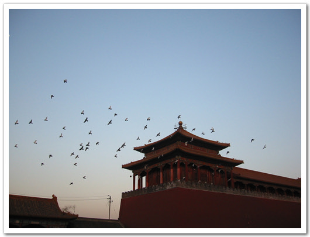

# 자금성

자금성이죠.

정확히는 자금성의 남문이라 할 수 있는 우먼.

이 문은 황제 드나들 수 있는 문이라 하더군요. 아 그리고 이 황제 결혼할 때만 한하여, 태후될 여자가 딱 한번 들어갈 수 있다더군요. 이 그러고보니, 날라가는 새들에 정신이 팔려 카메라 초점이 왼쪽 위로 향해져서 문이 안찍혀버렸군요...

이곳 자금성에 들어가면서 그다지 기분 좋지만은 않더군요.

요 몇달전 오마이뉴스에서 읽은 기사가 생각나는데, 예전 우리나라 사신들이 중국 황제를 만나기 위해서는 북경시외곽의 문에서부터 궁까지 계속 무릅을 이마를 땅에 대는 큰 절을 해가며 궁까지 왔었다고 했다고 하더군요.

게다가 요즘에 중국이 우리의 고구려를 자기들의 역사로 바뀌치려는 작업을 하고 있는 뉴스에 적잖은 위기감까지 드네요. 우리역사에 고구려와 발해가 빠져버리면... 생각하기도 싫군요.

[null](../6166951.html#6166951_1)

