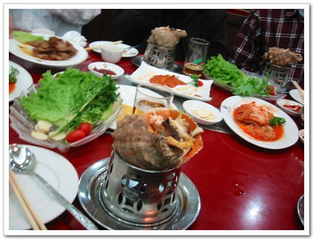

# 해당화의 신선로

제가 묵은 화두호텔근처에 북한음식점 해당화가 있지요.

신혼여행지도 금강산으로 정했으니, 북한 음식맛이 어떠한가 맛을 좀 봐야겠지요?

가장 기대되던 식당이었지요.

과연 북한 음식점 안의 분위기는 어떠한가 해서..

들어가니 리정실 복무원이 "안녕하십니까?"하고 맞더군요. 이 인사말이 가장 인상깊었어요.

일요일 아침에 하는 주간북한소식에 나오는 북한 앵커의 선동적인 말만 들어본 것이었는데, 성대 깊이후 공명되어 나오는 듯한 소리가 아주 이색적인 느낌었지요.

이곳에서 먹은 것은 신선로. 85원이나 하는 고급 음식이더군요.

소라껍질에 소라랑, 버섯이랑 해서 먹는 것인데, 정말 쥑이는 맛이더군요.

[null](../6166952.html#6166952_1)

