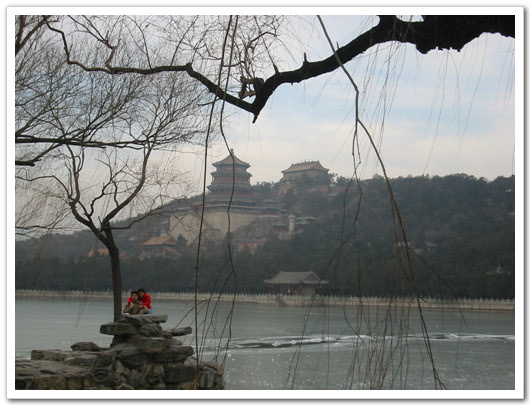

# 이화원

베이징의 3대 명승지라면,

천안문과 자금성, 만리장성, 이화원 이 세개를 보통 꼽더라구요.

이게 바로 이화원입니다. 입장료 20원.

서직문에서 726번 버스를 타고 한 시간 가량을 가니 이화원이 나오더군요.

크기는 무지하게 크더군요.

황제의 여름별장이고, 서태후가 주로 지냈던 곳이라고 하던데, 여의도의 몇배되는게..

추운 날씨에 호수는 얼어있어, 여기 관리인으로 보이는 몇명은 호수에서 스케이트도 타더군요.

이럴줄 알았으면, 출장올 때 스케이트도 들고 올 껄 그랬습니다.

시간 때문에, 두시간 밖에 못 돌아다녔는데, 반도 못 봤어요..

[null](../6166953.html#6166953_1)

