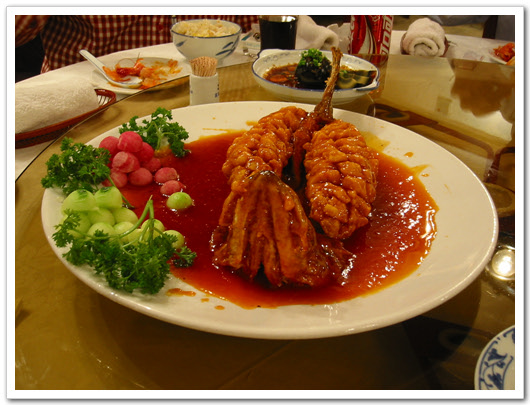

# 사천 생선 요리

여기 북경에서도 사천요리는 비싼 음식에 속하더군요.

아무래도 같은 중국이라도, 사천과 북경은 상당히 멀리 떨어져있으니..

오늘은 NGT China 근처의 사천식당에서 점심을 먹었지요.

시킨 음식중 하나인 생선요리. 제목은 잘 모르겠네요. 사진만 보고 음식을 주문해서리..

이 음식은 주문하고 나면, 살아있는 생선(아마 숭어처럼 보이던데..)을 직접 가져와, 확인을 시켜주더군요. 그 다음 다시 주방으로 가서 요리를 해 오는데, 소스는 탕수육 소스인데, 먹을 때, 전혀 발라먹을필요없이 젓가락만 대면, 그 조각조각 떨어지게 되어 있고, 맛도 생선비린내등은 전혀 없는 아무 맛있는 요리였지요.

값은 꽤 비싼 85원. 우리돈 만원정도하는 요리죠.

[null](../6166959.html#6166959_1)

