# 남천리 산촌 생태마을 2박3일 여행

5월 연휴기간 딸내미 친구 식구 총 6가족이 여행을 갔다.

장소는 충남 청양군 정산면 남천리에 있는 산촌 생태마을.

예전 꽤 오지여서, 정부 사업으로 마을에 펜션을 지어 마을이 운영하게끔 했다고 한다.

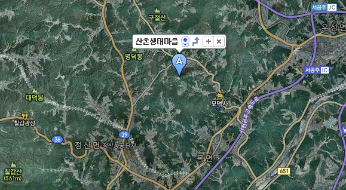

\- 서공주 IC에서 근처에 있는 산촌상태마을.  근처에 칠갑산이 있다.

\- 산으로 둘러쌓여 완전히 격리된 동네다.

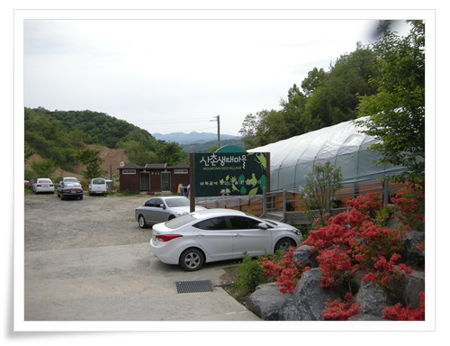

\- 산촌생태마을 중앙

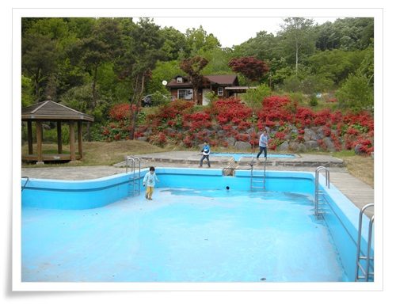

\- 제법 넓직한 수영장도 있다.

아직 여름이 아니어서 물을 채워져 있지 않지만..

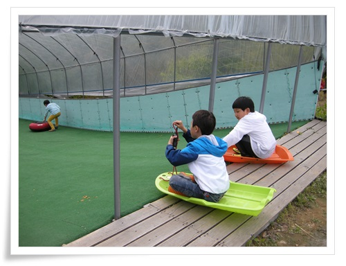

\- 겨울에는 눈썰매장으로 이용하는지, 썰매장도 있다.

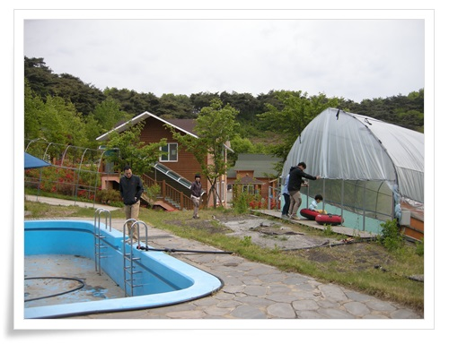

\- 저 앞 건물에 숙소인 펜션.

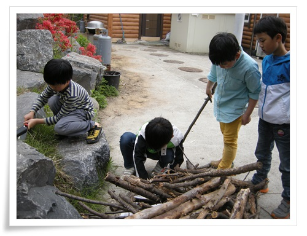

\- 애들에게 내 파이어스틸을 주니 정글의 법칙 김병만처럼 불을 켜는데 아주 신났다.

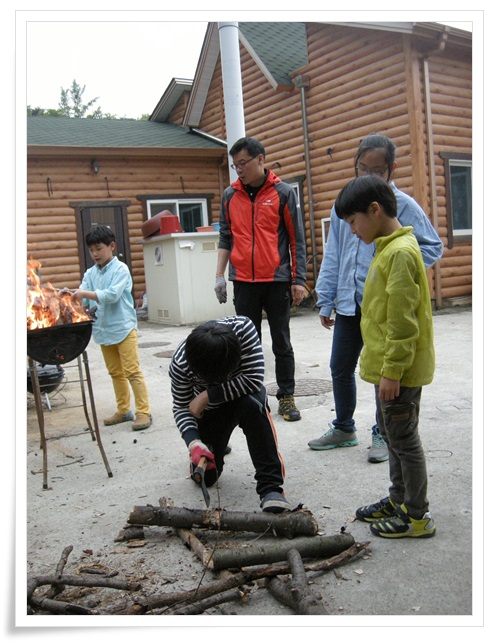\- 도끼로 땔감도 자르고..

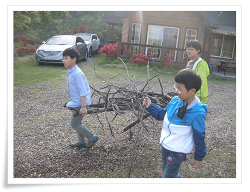\- 땔감도 구해오고..

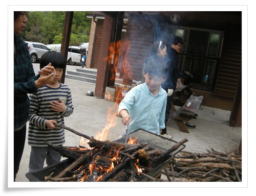

\- 그리고 불장난.

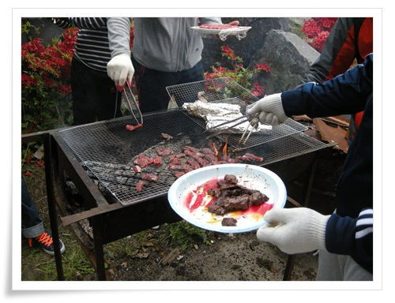

\- 그 불로 만든 숯으로 고기를 굽고,

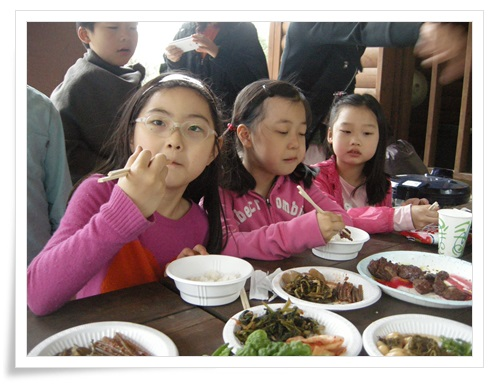

\- 밥을 먹는다.

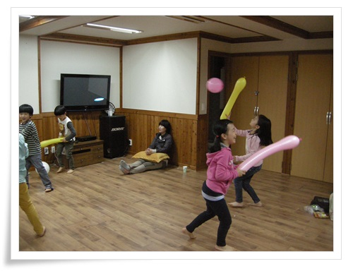

\- 방안에서는 풍선으로 놀고,

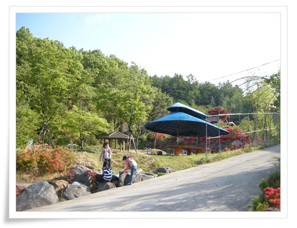

\- 밖에서는 소꿉놀이.

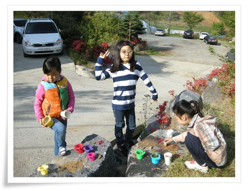

\- 소꿉놀이라기 보다는 걍 모래놀이인가?

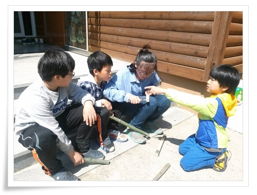

\- 근처 대나무밭에서 구한 대나무로 그릇도 만들어 보고..

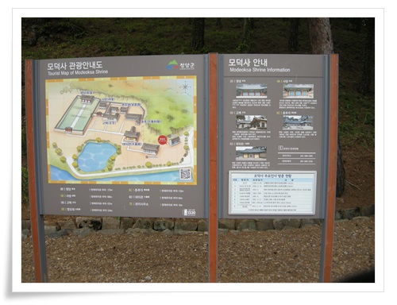

\- 면암 최익현을 모신 사당인 모덕사에도 갔다.

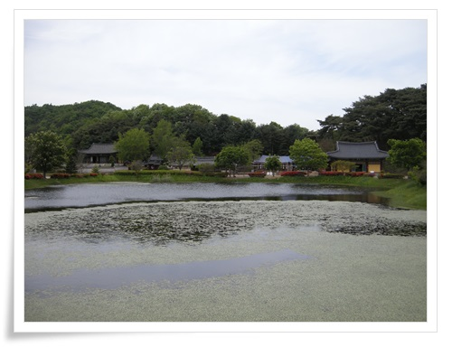

\- 연못이 아름다운 모덕사.

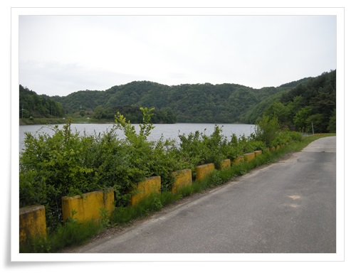

\- 연못 건너편으로 큰 저수지도 있다.

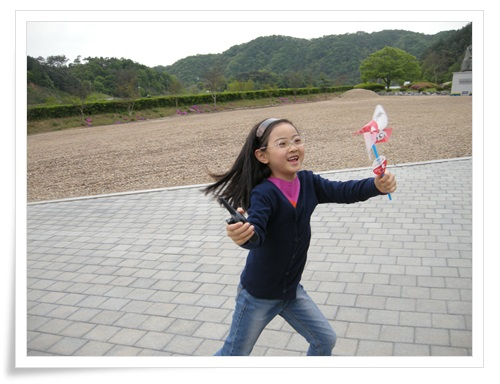

\- 바람이 제법 불어 신나게 바람개비 돌리는 딸내미.

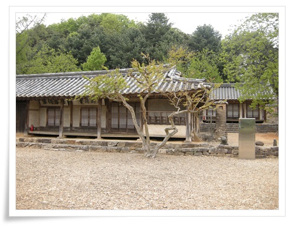

\- 면암 최익현의 고택.

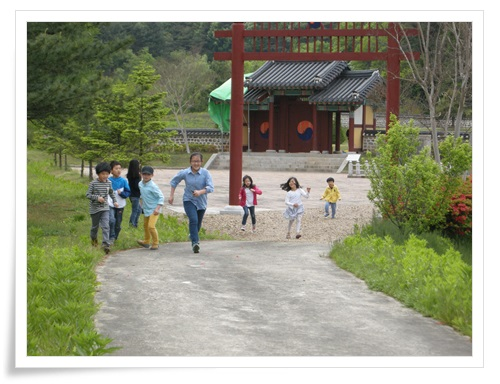

\- 애들은 잡기 놀이를 하며 신나게 논다.

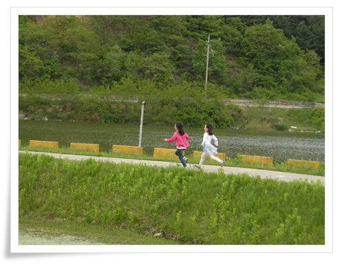

잘도 달린다..

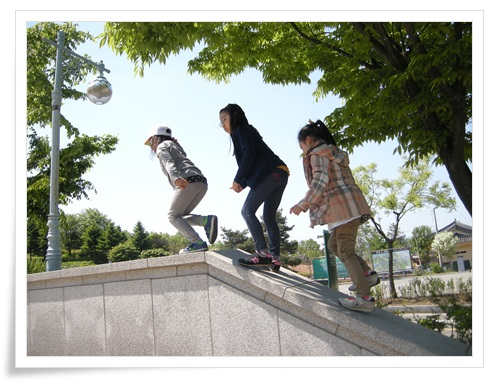

\- 공주 박물관도 들르고..

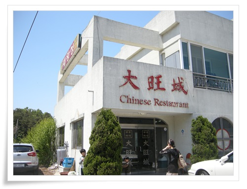

\- 여행 마지막의 점심은 공주박물관 근처에 있는 중국집.

근래에 먹은 중국음식중 최고의 맛이었다.

