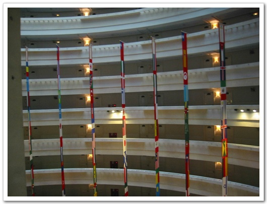
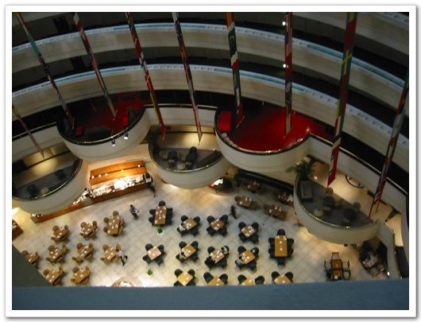

# 타이페이에서의 하루

이곳 타이페이는 위치한 위도가 말해주듯 더운 지방이다. 게다가 지금은 우기인 듯하다. 줄곧 비가 내린다. 무척이나 습한 기후를 가지고 있다. 그래서 그런가 냉방장치는 정말 잘 되어 있다. 어지간한 건물은 다 완벽냉방을 자랑한다. 어제 자는데, 이불을 덮고 잤음에도 불구하고, 가동되는 냉방장치로 서늘해져, 5시쯤에 깨어, 냉방을 히터로 바꾸고 다시 잤었다.

이곳 AsiaWorld Plaza Hotel의 아침부페는 어느정도 일까 기대를 하며, 내려갔다. 투명 엘리베이터에서 내려다보이는 내부구조는 방 내부 시설에 비해서는 비교적 근사해 보였다. 가든호텔 로비보다는 훨 못했지만..

저 밑이 아침을 먹는 레스토랑이다

아침부페는 아주국제호텔보다는 좀 나은 것 같았고, 가든호텔보다는 못한 듯 하다.

오전에 필드테스트에 대한 회의를 하고, 점심은 도시락을 먹었다. 맛있더군. 때마침 스티븐이 호텔이 놓고 온 고추장을 아쉬워하길래, 내 가방에 들어있는 고추장을 주었다. 작년 가을 샀었던 고추장을 이제야 처음 개봉을 한 것이다. 유효기간을 보니, 발효식품이라 그런지 아직도 꽤 많이 남아 있더군.

오후는 처음으로 하는 필드테스트였다. 타이페이 중심부를 3번 도는 거였다. 노트북을 무릅에 얹고, 양손을 핸드폰을 잡고, 한 눈으로는 지도를 힐끔 보면서, 전화걸고 받고를 4시간동안 하였다. 다행히 내가 탄 차가 벤츠여서 그나마 승차감이 괜찮아, 4시간동안 쉬지도 않고 하기는 했는데, 꽤나 손목과 허리가 쑤시더군.

이 도시는 서울과 비슷하다. 건물 모양도 비슷하고, 인도의 모양도 그 인도의 폭도, 지나가는 사람들의 걸음걸이와 생김새도 비슷하여, 다른 나라라는 생각은 들지 않았다. 그냥 서울인 것 같은 느낌이 들었다.

야간에 6대의 전화기로 idle test를 하기로 했는데, Ulicom이라는 업체에서 대접하는 저녁식사가 있어 거기서 저녁을 먹었다. 역시 마케팅팀이 같이 있으니, 좋은 거도 먹어보고 좋더군. 오늘 먹은 것은 닭고기로부터 시작하여, 랍스타, 양고기로 이어지는 풀 코스였다. 이정도면 일인당 한 20여만원은 되지 않을까 싶더군. 배를 꽉 채웠다. 빼갈을 권하는 그곳 사장이 있어, 빼갈 2잔과, 맥주 500을 먹었더니, 치사량에 도달하여, 꽤나 졸린 상태로 애써 졸음을 참으며 있었다.

