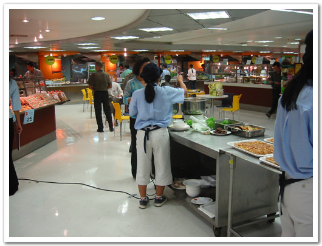
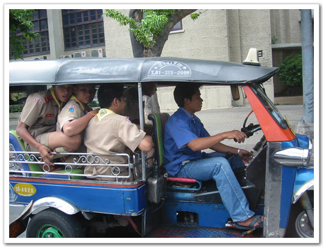
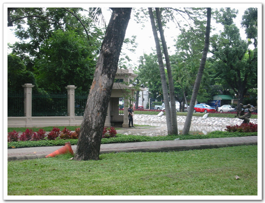

# 방콕에서의 필드테스트 마지막 날

이곳 방콕에서만 5일째가 된다. 이렇게 한곳에서만 계속있으니 무지 심심하군. 방은 이렇게 정리하지 않은 채로 지내고 있다.

3일째 날 숙소 근처의 food court에서 점심을 먹었다. 이름은 City Market

-우선 이곳에서 쿠폰을 산다. 각 음식코너는 현금을 받지 않고, 이 쿠폰을 받는다. 쿠폰은 바트와 일대일 매칭되며, 당일 쿠폰만 허용된다. 사용하고 남은 쿠폰은 다시 이곳에서 거슬러 준다. 난 100바트를 쿠폰으로 바꾸고 나서 30바트 짜리 음식 먹은 후 70바트 다시 현금으로 바꾸었다.

-이곳이 음식이 파는데와, 먹는 곳은 노란색 의자가 있는곳

-앞에 있는 내꺼 무슨 잡채랑 닭고기 튀긴것 같은 음식, 괜찮은 맛이었다.

점심을 먹고 난 후 나간 테스트길. 이 날은 Mr.Joe 라는 사람이 자신의 차로 두어시간동안 방콕시내 드라이빙테스트를 할 수 있도록 해 주었다.

-나의 Just go 방콕 이란 책에 포함된 지도를 보며 여기가 어딘지 설명해주는 조. 현재 왕궁근처인가 보다.

-가다 보면 툭툭이라는 택시에 이렇게 과다탑승을 하고 다니는 모습도 많다. 오토바이엔진인데, 힘이 괜괜찮나 보군.

-여기가 왕궁 주변이다. 왕궁의 각 모서리에는 저렇게 경비가 지키고 있군.

드라이빙 테스트를 마치고, 전철을 타고 숙소로 왔다. 저녁은 무엇을 먹을까 하다가 숙소 프런트에서 추천해주는 태국음식점에서 먹기로 했다. 프런트에 가서 어느 태국음식점이 좋으냐고 추천해달라니까 실롬거리에 있는 실롬빌리지를 추천하더군. 그래서 거기까지 걸었갔다. 한 30여분 걸어간 것 같다.

식당안에는 내국인보다 외국인이 훨씬 더 많았다. 전통식당이라 외국인이 더 많은 것 같다. 괜찮은 생겼다. 무대도 있어 공연도 같이 하더군. 우리는 무대 앞자리에 자리를 잡고, 음식을 시켰다. 음식이름은 잘 모르겠고, 꼼냥꽁과 볶음밥과 생선튀김류를 시켰다.

-숙소에서 먹었던 꼼냥꽁보다는 여기가 훨씬 맛있더군.

-이렇게 전통충 공연도 같이 하더군. 괜찮았다. 나중에 우리가 시킨 과일 주문을 빠뜨려 짜증이 나기 전까지는.

태국에 3일동안 있었지만, 스티븐과 같은 방을 쓰는 통에 내식대로의 탐험을 못했다. 스티븐이 좀체 잠을 자지 않는 통에.. 4일째 아침 토요일을 거사일로 삼고 6시에 일어나 탐험을 하기로 했다. 그래서 토요일 아침 6시에 일어났는데, 벌써 스티븐이 깨어 있는 거다. 그래서 거사는 포기했다.

토요일에는 전철을 타고 계속 돌아다녔다. 전철안은 시원하더군.

일요일 아침 다시 거사를 시행하기로 하고, 5시에 일어났다. 스티븐은 자고 있는 상태. 세수를 한 후, 바"ㄲ으로 향했다. 숙소 근처에 있는 룸비니 공원에 갔다.

-룸비니 공원은 저 왼쪽 큰 건물 뒤편에 있다. 거기까지 걸어갔다.

-여기가 룸비니 공원 입구쯤 되는 곳. 노점상이 많다.

-입구에는 더 많은 노점상들이 음식들을 팔고 있었다.

공원안에는 6시밖에 안되었는데, 많은 사람들이 있었다. 낮에는 날씨가 덥기 때문에 사람들이 아침일찍 움직이나 보다.

-이게 아침 6시의 풍경이다. 진짜 방콕사람들이 일찍 일어난다.

공원안에도 식당들이 있는데, 아침먹는 사람들이 많다. 방콕의 아침식사 시간은 6시인가 보다.

룸비니 공원의 크기는 여의도 공원의 한 세배정도 되는 것 같다. 이곳사람들도 중국 사람들처럼 공원에서 체조를 많이 한다.

-이렇게 스트레칭으로 몸을 풀기 시작하고,

-PT 1번 체조를하는 할버지도 있고,

-혼자서도 열심히 스트링을 하는 여자도 있고,

-정자 안에서 사교춤을 추는 사람들도 있고,

-부채체조를 하는 사람들

-모자춤을 추는 아줌마들

-봉체조를 하는 사람들

-단체 스트레칭을 하는 사람들.

-태국 전통 무예를 하는 사람들.

-태권도 아닌 것 같고, 가라데인가? 암튼 도복을 입고 무예를 닦고 있는 할아버지

-휴식을 취할 때도 이렇게 다리를 찢은 상태로, 휴식을 취하는 할머니.

-여기 할머니도, 고령에 주목 앞지르기를 열심히 하는군.

-여긴 서양승려도 있군.

아침 탐험을 이렇게 하고, 숙소로 서둘러 돌아왔다. 돌아온 시각 7시 반. 스티븐은 벌써 일어나 노트북으로 일하고 있더군. 나의 탈출이 들켰다.

아침을 먹고서 이번엔 전철말고, 버스와 배와 도보를 이용한 테스트를 하기로 하고, 전철의 맨 북쪽 종착역인 MoChit 역에 갔다. 그곳에서부터 돌아다니기 시작했다. MoChit 역엔 대규모 주말시장이 있는데, 남대문 시장 같은 곳이었다. 노트북 짊어지고 돌아다니는데, 날씨가 푹푹 찌는 듯해 진이 빠지더군.

-에어콘 버스도 탔다. 에어콘 버스의 요금은 거리마다 다르지만, 우리가 가는 선착장까지는 8바트.

-버스에서 내리니 선착장은 강 건너편에 있는 것이었다. 그래서 이렇게 다리를 건넜지.

-다리에서 보니 이런 수상가옥도 보이는군. 물을 흙탕물이다. 안내서에도 강이 무척 오염되어 있다더군. 그래도 이 강에서 수영하는 애들도 보이더군.

강을 건너니 배 탈수 있는 곳이 나타났다. 여기에서 조금 기다리니 배가 왔다.

배는 한강의 유람선과 달리 여기서는 주요한 교통수단이기 때문에, 꽤나 빠르더군. 석착장과 석착장간의 걸리는 시간은 한 3분정도.

\- 배에는 이 안내원이 동전이 들어있는 것을 들고 다니며, 표를 받더군. 배값은 1인당 10바트.

관광의 목적이라면 이 배를 타는 것도 괜찮아 보인다. 방콕을 한번에 둘러보게 되니. 주요 관광 명소가 이 강을 따라 이어져 있다.

-이게 와트룬이라고 하는데, 방콕의 1순위 관광물이라고 한다.

종착선착장에 도착하니, 이런 짓다가만 건물도 보이는군.

