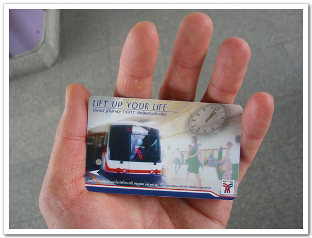
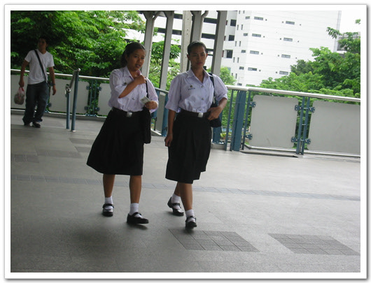

# 방콕에서 이틀째 날

내 숙소 Sathorn 맨션 찾아오는 방법은 이렇다.

이곳 태국에서 교민사회가 발달해있나 보다. 중국 텐진처럼,.. 교민사회정보지를 보니, 다들 한국관광객을 상대하는 관광업에 종사하고 있어 보인다. 잡지를 보다가 아주 멋있는 구절을 발견했다.

사스로 고통받고 있는 교민들의 애환이 닮겨져 있군.

아침을 먹고나서 레퍼런스폰과 SIM카드를 사기 위해, 전자상가로 갔다. 전자상가의 위치는 종합운동장역이다. 그래서 드디어 태국 2일차만에 태국 민초들의 삶을 바라다 볼 수 있게 되었다. 태국의 전철은 그리 싼 가격이 아니다. 거리마다 차등되는데, 거리도 별로 되지 않아, 종점에서 종점까지 한 20분이면 간다. 평균가격이 40바트정도 된다. 우리나라돈 1100정도 되는 거지. 우리나라 전철보다도 훨씬 비싼거다. 그러므로 태국서민들에게는 아주 비싼 거다. 그래서인지 전철은 깨끗했고, 있는 집 자식들로만 가득차있어 보이더군.

-전철표 끊는 기계는 동전만 받으므로, 이렇게 동전바꾸는 곳에 가서 동전으로 바꾼다. 그리고 다들 전화기 두대씩만 들고 있어 몸이 가볍지만, 나는 SIM카드 사자마다 로깅을 받기 위해, 등에다가 노트북을 짊어지고 걸어다녔다. 짬밥이 별로 안 된 관계로.. 오래걸으니 어깨가 꽤 아프더군.

-그런다음 이렇게 자동발매기를 통해 표를 사게 되지.

-전철표는 이렇게 생겼다.

-표를 샀으면 위의 시범조교 변이사님처럼 표를 넣고 뺀후, 통과하면 된다.

이곳의 전철을 BTS라고 부르는데, 전부 고가로 되어 있다. 그래서 상당히 전망이 좋다. 공기도 좋고, 수질도 좋은 편이고..

-이게 전철레일올라가기 전인데, 고가의 맨 위가 전철노선이다.

-올라가니, 그럭저럭 양호한 몸매의 아낙이 있군.

-건물들의 옥상쯤에 위치하여 전망은 괜찮다.

-각 승강장에는 이런 요원들이 배치되어 있다.

좀 웃긴건 이곳은 전철과 전철사이의 거리가 채 1km가 안된다. 그래서 역간 이동시간도 1분도 안된다. 그리고 모든 전철은 외부에 하나의 광고나 하나의 그림으로 되어 있다. 우리의 테마지하철처럼.

-외부의 모습은 이렇게 생겼다.

-내부의 모습은 이렇게 생겼고.. 관광도시라서 그런지 외국인의 모습은 항상 보인다. 그래서 그런가 태국인들은 영어를 잘 한다. 왠만한 상점의 점원들도 다들 영어를 잘 하더군.

목적지 종합운동장역에서 내려 4번출구로 나가니, 전자상가가 이어져있군. 이 근방은 방콕에서 물이 좋다고 하는 지역이더군. 우리로 치면 강남역 정도가 되겠지.

전자상가엔 핸드폰이 많더군. 그리고 핸드폰 부분품도 많이들 팔고 있더군. 여기선 본체껍데기뿐만 아니라, 안의 기판들도 파는게 있더군. 이곳은 자작 튜닝이 일상화되어 있나 보군.

-이 많은 휴대폰 껍데기들.. 이게 다 노키아전화기의 껍데기들이더군.

-전화기를 사기 위해 어슬렁거리다가,.

-이것들이 전시되어 있는 곳에서 전화기를 샀다.

이곳에서 나의 호기심을 자극하는 물체가 나타났다. 흰색셔츠에 검정색치마를 입을 여인네들이었는데, 처음엔 아 사람들이 여기 직원들인줄 알았다. 그런데 직원이 아닌듯했다.

-이 여인네들. 월남주름치마, 중국식으로 옆이 찢어져있는 치마, 무릅길이의 스커트로 나뉘는 이 여인네들의 정체는..

그래서 이 여인네들의 정체를 밝히기로 하고, 자료 수집에 나섰다.

-셔츠는 딱 달라붙는 정도의 사이즈 이며, 치마는 아까 언급한 바와 같이 3종류로 분료된다. 위 사진은 월남주름치마와 무릅스커트.

-그리고 허리띠에는 위 아낙과 같이 종이클립이 하나씩 끼워져 있다. 무슨 용도인지는 모르겠다.

1차 로깅을 받고 나서, 숙소로 돌아와 태국문화에 정통하신 최부장님으로부터 설명을 듣게 되었다.

이곳이 그 유명한 시암광장 구역으로서 젊은이들이 많은 거리라고 한다. 태국에서 제일 잘 나가는 대학인 출랄롱코른 대학교하고 몇개 대학들이 모여있는데, 위의 흰셔츠에 검정치마가 이 출랄대학교의 교복이어서, 그 학생들이 자부심으로 항상 입고 다닌다는 것이다. 그리고 치마의 종류에 따라 월남치마는 1학년, 중국식옆트인 치마는 2학년, 무릅스커트는 3학년이 아닐까 한다. 태국은 문맹률이 높아 학교다니는 것을 자랑스럽게 생각하고, 특히 교복, 제복을 좋아하여, 휴일같은 날에도 교복을 입고 다는 학생이 많다고 한다.

숙소로 돌아오는길이 본격적인 퇴근이 시작될려는 찰나인듯 했다. 거리가 차들로 메워지는 것들이..

-이게 무역센터인가?

-태국의 택시, 위에 taxi-meter라고 써져 있지.

-그리고 일반버스. 더워서 항상 문을 열고 다니더군.

-그리고 툭툭이라고 불리는 3륜오토바이택시. 이것의 가격이 일반택시보다 더 비싸다고 한다.

-겁도 없이 거리에 있는 개. 우리나라 같으면 복날을 앞둔 이 시국에 저렇게 도로에 퍼져 있지 않을텐데..

-뭔가 깨진 문자를 보여주는 우리폰.

숙소에 들어온지 20분도 안되어, 변이사님과 PCS1900 을 잡기 위해, 나섰다. 복장은 완전군장. 등에서 노트북을 손에는 L/T와 우리폰을, 다른 손에 레퍼런스 폰을 들고, 고스트바스터와 같은 몸동작으로 로깅을 시작했다.

-이런 농약뿌리는 포즈로,. 근처를 걸어돌아다니다가, 전철타고 다시 방콕시내 한바퀴.

