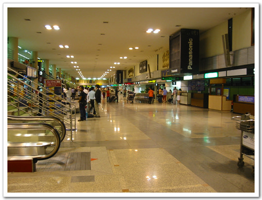
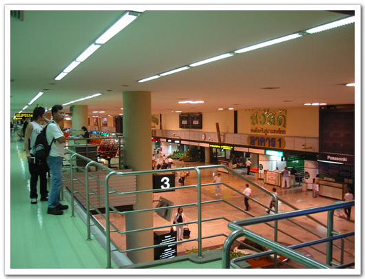
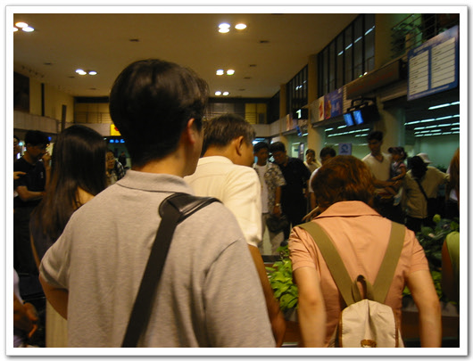
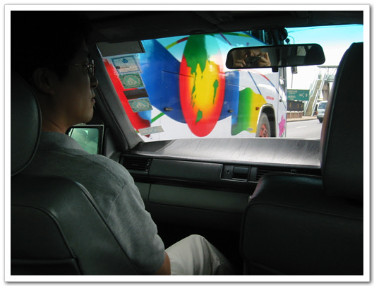
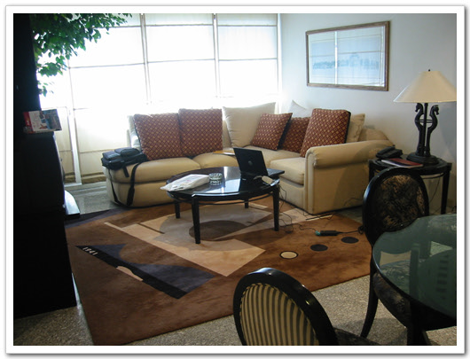
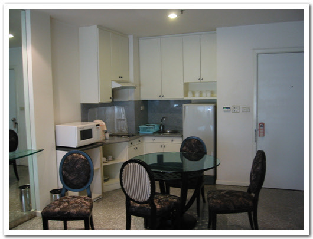
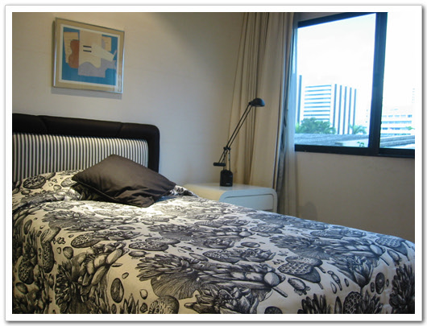
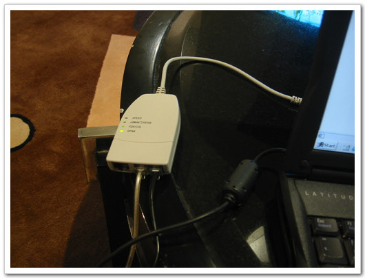
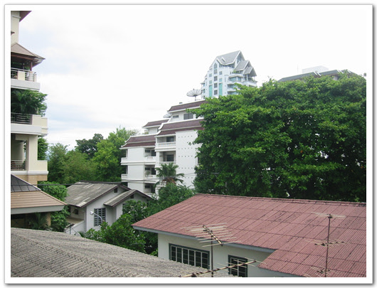
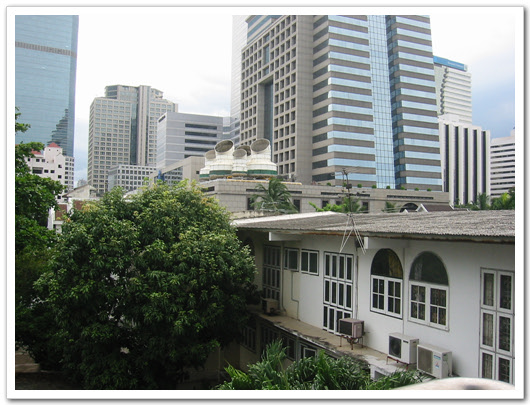

# 태국 도착 첫날

필드테스트를 위해 이번에 간 곳은 태국. 동남아시아 여행의 대표주자이지.

일정은 6월 18일부터 6월 24일까지 일주일 동안으로 잡혀있다. 태국의 수도 방콕으로 가는 타이항공은 10시 15분발이었다. 7시 10분쯤 삼성동 도심공항터미널에 도착하여, 50분에 공항버스를 타고 인천공항으로 갔다. 인천공항에 도착하니 9시쯤 되었다. 지난 달 대만갔을 때만 해도 인천공항이 아주 한산했었는데, 사스한파가 완전히 가셨는지, 북적북적댔다. 티케팅을 하고나서, 12만원을 환전하니 3900바트정도 되더군. 100바트가 우리돈 3000원정도 하는 셈이다.

비행기는 10시 40분쯤에야 이륙을 했고, 그 큰 777비행기가 가득찼다. 주말도 아닌 평일인데, 게다가 아직 휴가철도 아닌데, 이렇게 가득찬 상태로 출발하다니, 그 동안에 사스때문에 여행에 굶주렸던 사람들이 일시에 다 나온 모양이다.

비행시간 5시간 10분. 좀 길긴 하군. 승무원들은 친절했다. 성비는 남자반 여자반인 듯 하고, 수는 꽤 많았다. 내 가 본 서빙하던 승무원만 10명이 되었다. 기내식도 맛있더군. 대한항공보다는 조금 떨어지고, 아시아나보다는 낫고, 중국보다는 훨씬 낫더군. 가는 동안 나는 내 노트북으로 광복절특사를, 스티븐은 애니매트릭스를, 아트는 멀리 떨어져 앉아 모르겠다.

조금 편하게 오나 했었는데, 도착하기 1시간 전부터 왠 얼라가 울어대는데, 1시간동안 쉬지도 않고 있는 힘을 다해 울더군. 얼마전 김경률씨가 보내준 콘돔의 중요성이란 광고가 떠오르더군. 그렇게 시끄럽게 구는 얼라는 두들겨 패주어, 따끔한 맛을 보여주어야 하는데,..

방콕의 돈무앙 공항에 도착하여, 짐을 찾으려 하는데, 내 짐은 안 나오더군. 한참을 기다려도 안 오길래, 수화물신고서에 가서 짐이 없어졌다고 신고하고, 이것저것 적다보니, 짐을 찾았다는 연락이 왔고, 다른 사람이 자기 것인줄 알고 바꿔갔다는 거였다. 암튼 이런 일이 공항을 한 30여분 지체했다. 출구가 두군데 있었는데, 마중나온 사람은 반대편에 있어, 찾는데 10분 소요되었다. 마중나온 차량은 벤츠더군.

-방콕의 돈무앙 공항

-짐을 기다리는 많은 사람들... 내 가방은 이곳에서 안나왔지만..

태국의 도로는 좌측통행시스템이더군. 일본처럼 핸들도 오른쪽에 붙어있고, 차들도 왼쪽으로 하는게 막상 보니 낯설더군. 차를 타는데, 앞자리 운전석에 앉을 뻔 했다.

--핸들없는 운적석에서 어색해하는 스티븐

한 30여분정도 가니, 숙소인 SC Sathorn mansion에 도착했다. 호텔은 아니고, 무슨 콘도같이 생겼다. 아마 외국인용 비즈니스숙소 뭐 그런건가 보다. 아트가 706호 독방 1,100바트짜리 방이고, 나와 스티브은 같은 방 403호다. 스위트룸비스므레한건데, 2,500바트짜리 방이더군. 하루 8만원정도 되는 건가 보다. 출국전 호텔이려니 생각하고 평소준비해갔던 칫솔도 안가져 갔는데, 이곳은 그런게 아예 없다. 슬리퍼도 없고,. 그냥 콘도다.

실내는 이렇게 생겼다.

-응접실의 모습들

-내가 잘 침실

인터넷은 다이얼업모뎀은 아닌 것 같고, 암튼 이렇게 생긴 것을 USB에 설치하니 USB-LAN으로 인식하더군. 전화선에 물리는 걸로 봐서 ISDN 같은 것인가 보다. 속도는 아주 무지무지하게 느리더군. 툭툭 잘 끊기고...

설치해주던 직원은 무척 친절하더군.

일일이 세팅다하는데, 성심성의를 다하는 모습이 보기 좋더군.

6시쯤 되어 조부사장님, 변이사님, 최부장님, 이렇게 먼저 와 있던 사람들과도 만나 테스트 회의를 했다.

그러고 나서 저녁 먹으러 간 시간 9시. 한국 시간 11시에 저녁을 먹으러 가는 거다.

-이 USB2LAN 으로 인터넷을 한다

-내 방에서 바라본 바깥풍경. 하늘은 비록 흐리긴 했지만, 상당히 깨끗하여 시야가 넓었다.

저녁은 한국식당에 가서 삼겹살과 된장찌개를 먹었다. 내생애 이렇게 맛없는삼겹살과 된장찌개는 처음 먹어본다. 김치와 콩나물마저도 어찌나 맛이 없던지.. 싱싱한 태국 현지 음식을 먹어야 하는데, 태국음식도 못 먹어보고 하루를 보냈다.

