# 이집트에서의 생활

이집트에서의 생활

내가 이집트에 도착하기 이틀 전부터 라마단 기간이 시작되었다. 라마단이 뭔지는 잘은 모르겠지만, 해뜨면서부터 해질때까지 금식하는 기간이란다. 그래서 이 기간에서 식당들도 거의 영업을 안하고, 상점들도 별로 안 열어, 관강시즌으로는 비수기인셈이다. 내가 묶은 매리어트 호텔도 라마단기간이라, 호텔앞에는 라마단 기간임을 표시하는 장식물이 걸려있었고, 방값도 비수기 가격으로 해주더군. 식사빼고 90달러인가 그랬다.

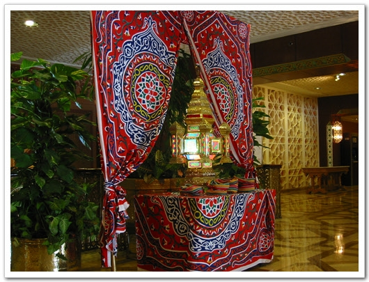

\- 이게 라마단 기간임을 나타내는 표식

이집트. 아프리카지. 북아프리카. 내가 아프리카 땅을 밟아보다니.. 박성용 정말 출세했다. 매리어트 호텔명 앞에 resort 란 말이 붙는 걸로 봐서, 관광호텔인가 보다. 서울의 매리어트 호텔은 그냥 건물만 떡하니 서 있던데.. 호텔의 건물과 시설은 좋았다. 게다기 이 호텔이 중안 건물이 원래 왕궁이었다고 한다. 왕궁치고는 조금 작긴 하지만, 앞에 정원도 있고, 멋있었다.

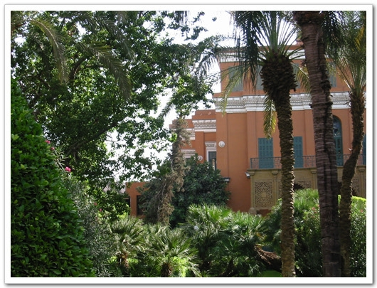

\- 더운 지역이라, 저런 열대 나무들이 있군..

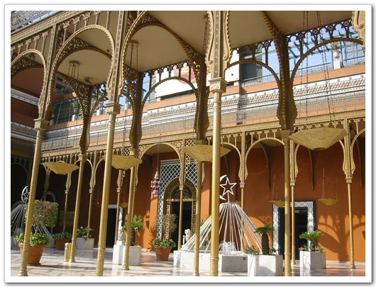

\- 호텔 정문. 들어가기 위해선 공항처럼 보안 검색을 해야 한다. 폭발물 감지를 위해서란다.

날씨는 사막의 도시답게 낮에는 덥고, 밤에는 추은 날씨다. 그리고 낮에 덥긴 해도 습하지 않아, 햇볕에만 있지 않으면, 그리 더운 지 모르는 날씨다.

원래 이집트에 오기전 이집트 여행 안내 책을 사려고 영풍 문고에 갔었는데, 이집트에 관한 책은 없더군. 그게 못내 아쉽다. 다른 서점에 가서서라도 꼭 사 둘 껄. 여행이란게 아는 만큼 보인다고 정말 이집트에 대해 아는 것이 없으니, 구경하고 싶어도 뭘 구경해야 할지조차 모르겠더군. 내가 이집트에 대해 아는 거라고 피라미드, 스핑크스, 나일강 이것밖에 몰랐으니..

여기 이집트에서 나를 도와주는 현지인은 자말이라는 사람이다. 나이는 한 50은 넘어보이는데, 사람 참 괜찮다. 예전 사우디에서 현대건설 에이전트일을 했었고, 지금도 여기서 현대 관련된 일을 한다고 하더군. 이 사람에게 심카드랑, 충전카드랑을 받았다. 내가 처음 목요일날 귀국할거라고 하여, 내게 화요일에 이집트의 최대 휴양도시 알렉산드리아를 구경시켜줄 계획이라고 했는데, 일이 잘 해결되는 통에, 아쉽게 됐다.

다른 이집트인들도 대체로 친절하다. 관광국가답게. 대신 바가지도 엄청 심하다. 내가 여기 된통 당하기도 했지만.. 그리고 어딜가나 팁 요구가 심하다. 세상에 공항에서도 팁을 요구하더군. 카이로공항은 티케팅하기 전 보안검사부터 한다. 청소부로 보이는 사람이 내게 암스텔담 가는 비행기 보안검사 시작한다고 알려주더군. 그러더니, 내 가방을 자기가 끄는거다. 한 3미터 끌었나? 그러더니 돈을 달라고 한다. 아마 변이사가 여기에 속아 80파운드를 날렸을 것이다. 당근 안줬다. 그리고 비행기 타기 전 화장실에 들렀다. 거기도 왠 청소부가 날 반갑게 맞이하더군. 볼 일 보고 손 씻고 나오는데, 내게 화장지를 주더군. 주는 것은 또 받았지. 그러더니 팁 달라고 했다. 못 들은 척 하고 그냥 내 갈 길을 갔다.

카이로에서는 딱 한 번 아침 산책을 했다. 별 다른 게 없었다. 지형도 익힐겸 하여, 지도를 보고 호텔주위를 돌았다. 물을 샀었던 상점도 아직 문을 안 열었고, 다른 가게들도 모두 문 연 곳은 없더군. 나일강변에 도달했을 때, 거기엔 모스크가 있었다. 카이로의 모스크는 우리나라의 교회 있는 것 만큼이나 많았다. 그래도 우리나의 교회들에 비해 여기의 모스크는 주변과 잘 어울린다. 모스크는 이슬람의 예배당같은 곳이라 한다. 나일 강 건너편으로도 가 보았다. 근처가 학교이고, 때마침 등교 시간인지, 학교가는 애들로 제법 활기가 있어보왔다.

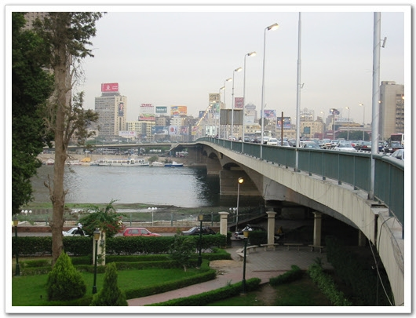

\- 걸어갔던 길.

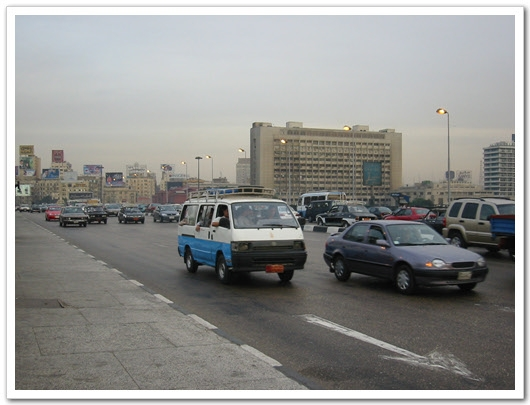

\- 차들은 대체로 낡은 편이나, 습하지 않아, 잔고장은 없다고 한다.

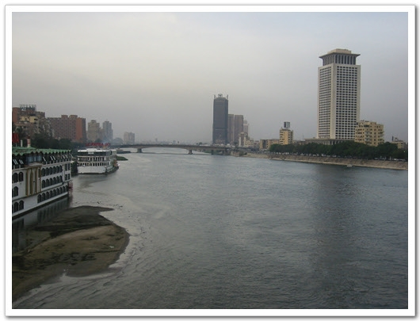

\- 이 강이 바로 나일강

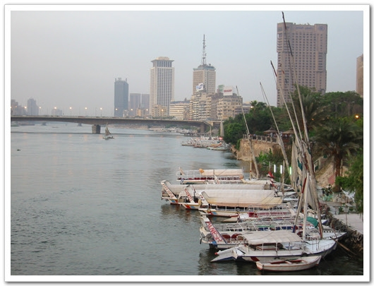

\- 밤에는 저 배로 하는 나일강 투어가 유명하다고 한다.

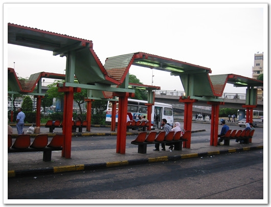

\- 카이로에서 제일 큰 버스 터미널

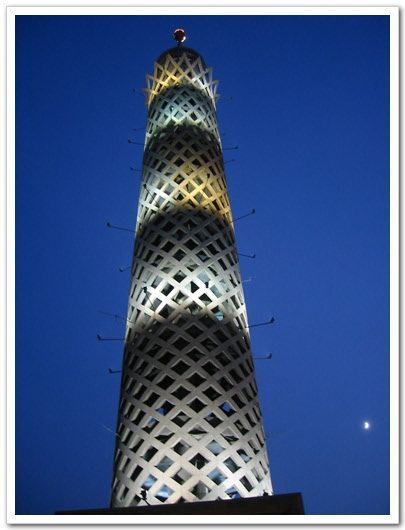

\- 카이로에서 제일 높은 타워. 입장료가 40파운드라, 안 들어가봤다.

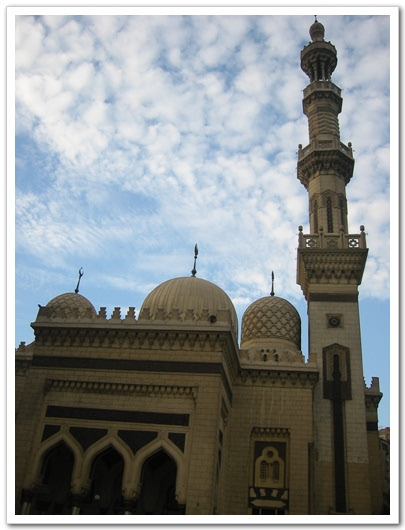

\- 호텔 근처의 모스크. 이름은 잘 모르겠다.

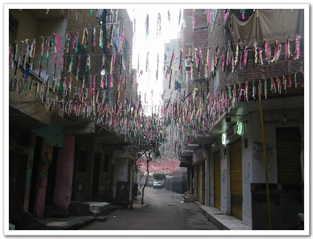

\- 도시 뒷골목. 지나다니는 사람들이 없군.

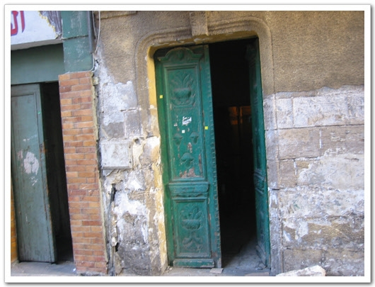

\- 열린 문 사이로 빼꼼이 들어다보기도 하고,..

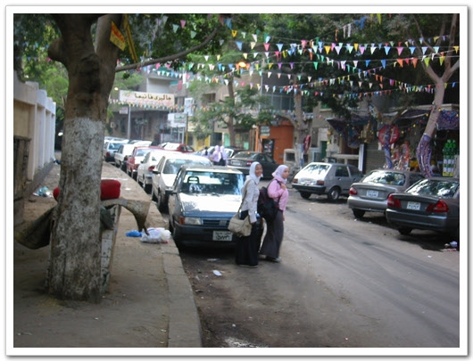

\- 등교하는 학생들

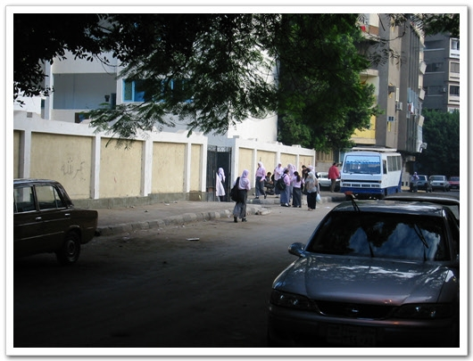

\- 이곳이 학교인가 보다. 문이 작군..

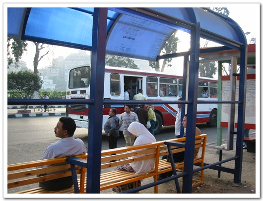

\- 출근길 버스 기다리는 사람들

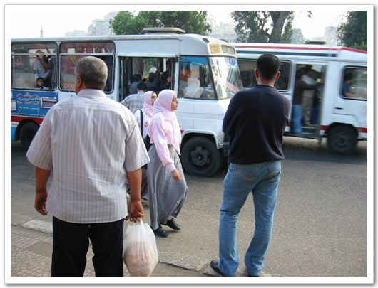

\- 이곳은 버스가 정차할 때 타는 게 아니라, 가고 있는 도중에 버스 속도로 뛰어가다 타야한다.

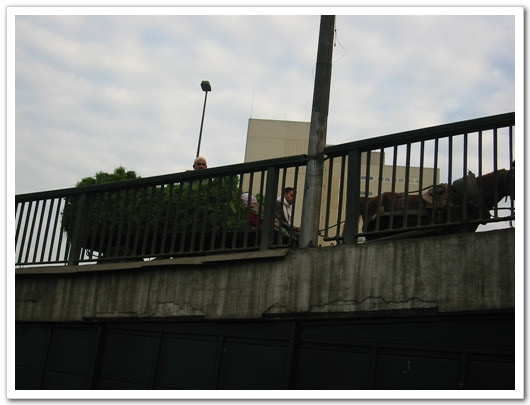

\- 도로엔 차 뿐만 아니라, 이런 우마차도 같이 다닌다.

