# 스핑크스와 피라미드

스핑크스와 피라미드

이집트에 왔으니, 피라미드와 스핑크스를 안 보고 가기에는 너무 안타까운 일 것이다. 내 평생 앞으로 이집트로 두 번 다시 올 것 같지도 않고 하여, 일을 저질렀다. 여기 시간 오전 11시. 피라미드가 있는 기자로 가기로 하고, 작은 가방을 메고 호텔 문을 나섰다. 호텔에서의 코스도 있었다. 호텔에서의 가격은 오후 두시간정도되는 피라미드 스핑크스 투어로 25달러더군. 비싸다고 여겨 그냥 택시타고 가기로 했다. 인터넷에서 보니 기자까지 15에서 20파운드 정도 된다는 하더군. 우리 돈 3,4000정도 되는 거지. 그리고 기자에서는 낙타 타는데 워낙에 바가지가 심하니 조심하라고 나와 있더군. 낙타 타는데 15달러라고 하면서 여행기에 적혀있었다. 그리고 많은 사람들에게 피라미드 관광은 바가지와 사기로 악명이 높더군. 그래도 한 번은 해보기로 했다.

호텔소속의 차가 있는 것으로 개인영업을 하는지, 말쑥한 차림의 사람들이 기자까지 태워다 주고, 두 시간 기다린 후, 호텔로 다시 데려다주는 걸로 110파운드를 부르더군. 2,2000원정도 되는 거지. 비싸므로, 그냥 원래 계획대로 택시타기로 했다. 근데 호텔을 벗어나 길로 접어드니, 한 삐끼가 붙었다. 생김새는 예전 에어울프에서 부조종석에 탔던 착하게 생긴 아저씨처럼 생겼다. 이름은 마그디. 피라미드 갈려는데 얼마냐 그러니, 데려가고 4시간 기다렸다 오는데, 60파운드랬다. 무시하고 가는데, 얼마나를 생각하냐길래, 난 40파운드를 불렀다. 몇 번 흥정을 한 후, 40파운드로 정하고, 차를 탔다. 괜찮은 가격이라 생각됐다.

가는 도중, 멤피스와 사카라도 같이 가면 얼마에 해줄꺼냐 물으니, 120파운드랬다. 난 70파운드에서부터 흥정을 했는데, 가격이 절대 안내려가더군. 그래서 그냥 피라미드만 구경하기로 했다. 멤피스에는 람세스 3세 동상이 거대하게 있다했고, 사카라에는 계단식 피라미드가 있다고 하여, 보는 김이 같이 볼 생각이었는데 말이다. 기자에서 멤피스와 사카라가 25km 정도 떨어져 있어, 그 가격보다 더 내려가기 힘든가 보다.

\- 스핑크스와 피리미드가 있는 기자로 가는 길

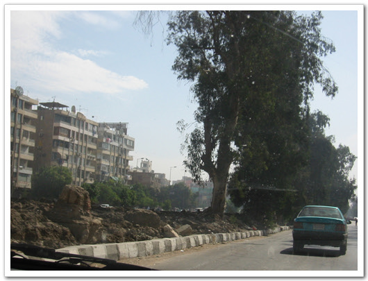

\- 여기가 기자다. 그리 썩 정비되어 있는 곳은 아니다.

\- 드디어 피라미드가 그 웅장한 모습을 드러냈다.

기자에 도착하니, 마그디가 입장료 무료인 박물관이라면서, 구경하라더군. 의심쩍었지만 들어갔다. 파피루스 파는 상점이더군. 대충 붙어 있는 가격들을 보니 400파운드 적혀있고, 장난이 아니더군. 내가 들어가니, 점원한명이 파피루스 만드는 방법을 보여주겠다며 나무를 잘라 파피루스를 만들더군. 다 보지 않고, 급한 일이 있어, 돌아가야겠다고 하며 상점을 나왔다. 마그디에 대한 믿음이 사라졌다.

원래 생각은 낙타를 탈 생각은 별로 없었지만, 날씨가 장난 아니고, 피라미드 둘레의 길이도 장난이 아니더군. 그래서 그냥 바가지 쓰자 생각하고, 아는 낙타를 소개해 달라고 마그디에 말하니, 아는 사람에게 가더군. 15파운드는 전혀 안된다고 하더군. 최저 50파운드까지라면서.. 그래서 그냥 걸어가겠다고 하니, 더 이상 흥정을 않고 물러서더군. 내가 본 인터넷의 그 정보는 옛날 정보였나? 아님 이 아랍상인들의 상술이 고도여서인가, 좀 당황됐다. 이정도면 그럼 30파운드라며 가격이 더 내려갈 줄 알았는데 말이다. 그래서 40파운드에 절대 추가요금 없다고 약속을 받고 하기로 했다.

\- 낙타 위에서 본 피라미드. 아직 들어가기 전인데, 좀 설레긴 하더군.

\- 피라미드 입장티켓과 피리미드 내부 입장 티켓

낙타 타는데 사람이 두 명이나 붙더군. 심상치 않았다. 알리라는 가이드가 말을 타고, 나는 낙타를 탔다. 낙타는 또 한명이 걸어서 끌었다. 낙타 등에 올라서니 꽤 높더군. 승용차보다도 높고, 찝차 지붕 정도 되는 높이였다. 승차감이 괜찮은 편이였다. 알리가 날씨가 더운데, 헤어스트랩 할 거냐고 묻기에, 안한다고 했다. 그런데 가다보니, 정말 햇볕이 뜨거웠다. 그래서 헤어스트랩 사달라고 했다. 그건 5파운드다.

\- 낙타를 끄는 사람. 이 사람은 아무 말도 안하고, 수고도 제일 많이 한 것 같아, 팁을 주고 싶기도 했었는데, 옆의 알리가 하도 팁 달라고 그러는데 바람도, 애까지 같이 팁을 안 줬다.

\- 애가 알리다. 대학교에서 법을 공부한다는데, 암튼 계속 시끄럽게 떠들어대더군..

\- 피라미드 입구를 향해 가는중. 낙타의 높이가 어느정도인지 감이 오겠지?

피라미드 입장료는 20파운드. 운영도 오후 세시까지 밖에 안한다. 걸어서 들어가는 곳이랑, 낙타타고 가는 코스랑은 달렸다. 걸어서 들어가는 길은, 스핑크스로 곧장 이어지는데, 낙타는 9개의 피라미드를 다 돌고, 맨 나중 스핑크스를 보는 코스다. 처음엔, 기독교 건물이 있었다. 이것도 꽤 오래된 거라더군. 성경책에 나오는 그 시절인가 보다. 그리고 무슬림들의 묘가 있었고, 땡볕을 계속 갔다. 피라미드 내부로 들어갈 수 있는 것은 큰 피라미드는 아니고, 좀 작은 피라미드였다. 안에 아무것도 없이, 방만 두개라고 알리가 말해주면서, 그래도 안에 들어가겠냐고 했다. 들어가보겠다했다. 입장료는 10파운드.

\- 알리의 말과, 내가 탄 낙타. 낙타와 말이 같이 있으니, 말이 꽤나 왜소해보이더군.

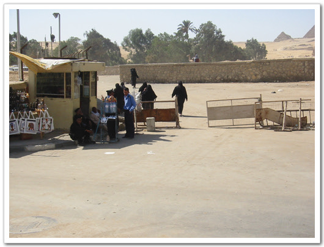

\- 여기가 낙타타고 가는 입구. 이 세계적인 피라미드에 어울리지 않은 허술한 입구다.

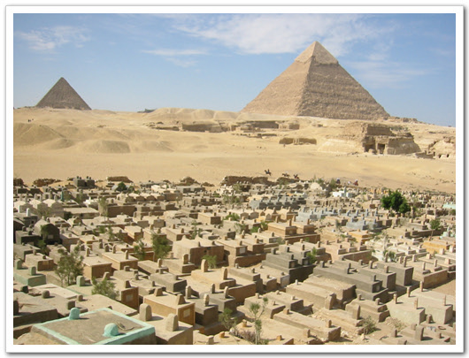

\- 그 동안 사진으로만 보았던 피라미드다.

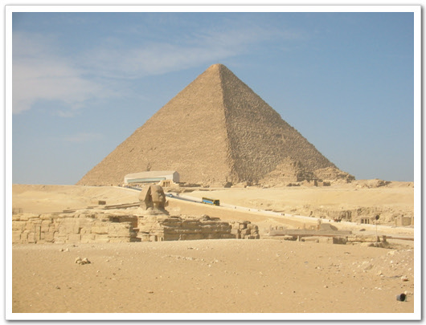

\- 이게 쿠푸왕의 피라미드라던가.. 크긴 정말 크다. 거리도 꽤 멀다.

\- 무슬림들의 묘

-원래 피라미드를 주위를 싸던 성벽이었나? 관리는 영 안하는지, 돌들이 다 굴러다니는군..

\- 이집트의 종교 10%를 차지하는 콥틱의 유적지다. 기독교지.

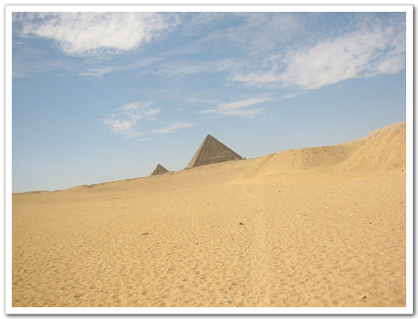

\- 사막이다. 그야말로 광활한 사막.

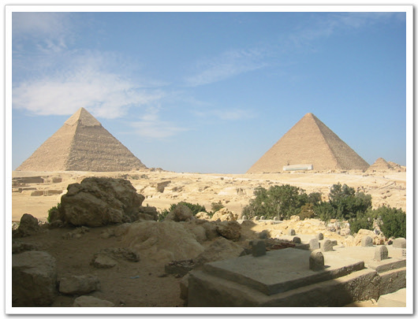

\- 피라미드까지는 꽤나 멀군. 저걸 걸어다닐려면 꽤나 시간 많이 걸리겠군..

\- 무슬림의 묘와 같이 보이는 피라미드

\- 낙타위에서 힘겹게 찍었으니, 다 보여줘야지..

\- 원래의 피라미드는 저 위에 반질반질한 돌로 다 덮여져 있었는데, 저 꼭대기만 남고 다 없어진 거라 한다.

\- 저기 앞에 있는 점이 사람이다. 돌 하나 높이가 사람키보다도 크니, 그 얼마나 큰가..

\- 수고하기는 낙타를 끈 이 사람이 제일 수고를 했지. 한시간 넘게 낙타를 끌고, 돌아다녔으니..

낙타에서 내려, 피라미드 안으로 가는 표를 끊으로 가는데, 또 다른 삐끼 등장. 애의 이름도 알리. 알리바바의 알리란다. 생김새는 몸집도 크고, 한 성깔해 보이게 생겼더군. 피라미드에 대해서 자세히 설명을 해주더군. 열심히 따라오면서.. 매표소에서 표를 사니, 어디 에서 왔냐고 하기에, 한국이라고 하니, 뭔가 아는 체를 하면서, 반갑다고 하더군. 피라미드 들어가는 입구에서는 사진촬영이 안된다고 소지품 검사도 하더군. 거기서도 나에게 어느 나라 사람이냐고 묻기에, korea 하니, 감사합니다라고 한국말을 하더군. 괜찮은 사람들이더군.

들어가는 입구에서부터 앉은뱅이 자세로 쭉 내려갔다. 좁은 곳이라, 폐쇄공포증있는 사람은 들어가기 힘든 곳 같더군. 쭉 내려가니, 큰 방이 있었고, 거기서 더 내려가니, 왕의 묘와 또 다른 묘의 자리가 있더군. 그 큰 돌덩이들로 이렇게 큰 피라미드와 내부를 만들었다니 대단하다는 생각은 들더군. 이걸 어떻게 만들었을까하는 경이감도 들었다. 내부에는 진짜 아무것도 없었다. 안에 들어있는 것은 영국과 프랑스에 약탈당해 그 나라 박물관에 있다더군.

피라미드에서 나오니, 아까 그 알리바바라는 삐끼가 다가오더니, 그 피라미드 안에 들어가는 표를 왕의 묘에서 들어갈 수 있다면서, 따라오라더군. 나 바빠서 가기 싫다는데도 1분이면 된다면서, 따라오라기에, 안 좋은 조짐임을 인지하면서도, 그래 니가 나한테 뭘 어쩌겠나냐싶어 따라 갔다. 가는 길은 피리미드 옆쪽의 으슥한 곳이었다. 왕의 무덤이라면서 말하는데, 뭐 뭔지는 모르겠더군. 피라미드 사진 찍기는 좋은 장소 같긴 했다. 거기서 사지한방 찍었다. 나도 찍어주겠다는데, 난 사진 찍히는 안 좋아한다고 거절했다. 그리고 좀 더 뭘 안내하겠다는데, 그만한 보겠다면, 낙타가 기다리는 곳으로 가는데, 앞을 가로막더니, 안내를 해 주었으니, 돈을 내라는 거다. 내 이럴 줄 알았지. 난 안 낸다. 받고 싶으면 경찰한테 같이 가자하고 말하고, 무시하고 가니, 뒤에서 shit, fuckyou라고 욕을 하더군. 그래서 뒤로 돌아, 근엄한 한국말로, "시끄럽다. 조용히 해라"라고 따끔히 혼을 내 준 다음, 가운데 손가락을 세워 보여주었다.

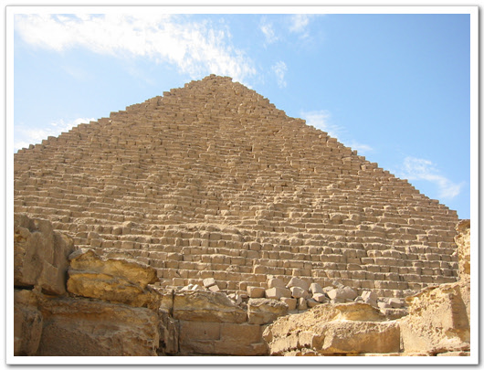

\- 안으로 들어갈 수 있게 현재 공개한 피리미드는 이 것 하나뿐이었다. 이 으슥한 장소가 삐끼가 데려온 곳이다.

다시, 낙타를 타고 나머지 가장 큰 피라미드인 쿠푸왕의 피라미드를 보고, 스핑크스로 향했다. 사진에서 보면, 스핑크스와 피라미드가 바로 옆에 있어 보여 가까운 줄 알았는데, 꽤 멀더군. 한 500미터는 떨어져 있는 것 같았다. 여기 피라미드에서도 잡상인들이 있는데, 여기 잡상인들은 낙타를 타고 다니면서, 콜라, 사이다를 팔더군.

스핑크스는 돌 한 덩이로 만든 거라더군. 꽤나 큰 돌이더군. 이게 원래 이집트에 있었던 돌이었나?..

\- 피라미드를 뒤로 하고..

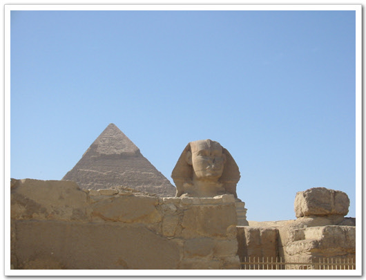

\- 스핑크스. 저 큰게 돌덩어리 한개라니..

\- 조금씩 옆모습이 보는군..

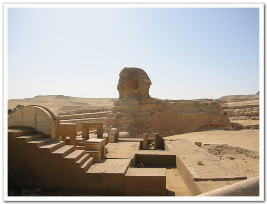

\- 깨어진 코도 보인다.

\- 스핑크스와 피라밋. 저 거리가 500미터 정도 된다.

\- 내가 많이 보던 사진과 같은 구도다. 스핑크스와 피라미드가 같이 있는 모습

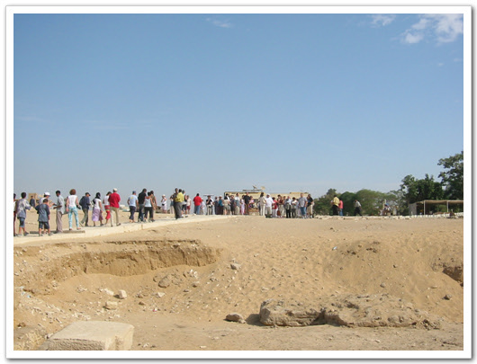

\- 피라미드 구경하고 가는 사람들과 오는 사람들.

\- 스핑크스에 좀 더 가까이 가는 것도 요금을 별도로 내야 한다. 그래서 저 철문이 있다.

너무 더운 날씨이기 하고, 아까의 짜증이 있어, 빨리 돌아가고 싶었다. 차가 있는 곳으로 갈 때까지, 알리가 계속 행복하냐고 물어보는 거다. 그래서 행복하다. 좋다고 계속 말해줬다. 그러더니, 결국 계속 그렇게 물어 본 이유가 나오더군. 네가 행복하니, 내가 제대로 일은 한 것 같다. 나로 인해 네가 행복하니 팁을 달라, 이러는 거다. 내 원래 성질이 팁은 정말 주고 싶을 때만 주기 때문에, 댁도 없다고 일축했다. 난 40파운드 외에 더 이상의 extra fee는 없다고 네 boss에게 말했다고 하고, 돌아갔다. 그래서 별도의 팁은 안냈다.

차를 타고, 돌아왔다. 원래 이럴 줄은 각오하고 구경한 거지만, 기분은 썩 좋지는 않더군. 기분 좋은 관광이 되지 못한 게 좀 아쉽더군.

\- 기자의 주택가. 주택모양이 완전히 각이 졌다.

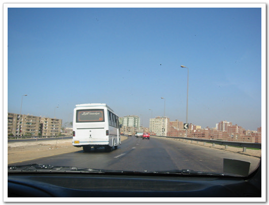

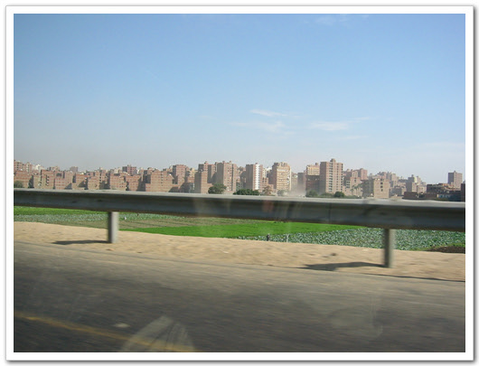

\- 스핑크스를 뒤로 하고, 카이로로 돌아가는 길

이렇게 해서 총 들어간 돈은, 40+40+5+20+10=115파운드군. 2만 3천원정도 든 셈이군. 호텔의 단체패키지와 별 차이가 없군. 하긴 호텔패키지엔 낙타타는 게 없고 내부입장도 없으니, 그걸로 위안을 삼자.

다음에 혹시 파리미드에 다시 올 기회가 된다면, 기자까지 택시를 타고 와서 스핑크스하고, 큰 피라미드만 보고 가는 것도 괜찮을 것 같더군. 그리고 입구 앞에 KFC와 pizza hut이 있는데, 거기 3층에서 보면 피라미드와 스핑크스가 다 보이기 때문에, 그 시원한 곳에서 여유 있게 멀리 보는 방법을 한 번 해 봐야겠다.

