# 여름 전국 일주 2

2003 전국일주 -2

경주에서 점심을 먹었다. 경주의 무슨 시장 이였는데, 그곳들을 반찬부페로 밥을 주더군. 반찬 한 10여 가지 정도 되고, 그 반찬을 자기 마음대로 골라먹는거였다. 가격은 3000원. 싼 가격에 맛도 좋고 음식도 잘 나오고 좋았다.

다음 목적지는 보성차밭. 거리는 한 300여킬로미터 떨어진 곳이다. 경주에는 경부고속도로를 탄 후, 금호에서 88고속도로를 타 남원으로 가서, 남원에서 국토를 탈 생각이었다. 휴가철이어서 그런가 아니면 원래 그렇게 막히는 길이었던가, 경산에서 대구까지 지체와 서행을 반복하는 길이었다. 날씨까지 햇볕은 쨍쨍 모래알은 반짝하는 통에 에어컨도 별 소용없었다. 88고속도로의 종점이 광주, 담양이었기에 금호근처에서 언제 분기점이 나오나 하며 푯말을 잘 보며 운전했다. 그런데, 좀 전에 보였던 광주방향 분기점 표지는 안보이고, 웬 춘천방향, 마산방향이란 푯말만 보였다. 춘천이면 북쪽으로 가는 거고, 마산이면 남쪽인데, 이 두개는 아닌가 보다 했었는데, 갈림길을 지나쳐서야 광주방향이 표지는 춘천방향 표지 뒤에 가려있는 게 보였다. 화가 나더군. 뭐 저따위로 방향표시를 해놓는단 말인가 하고,.. 아무튼 돌이킬 수는 없었기에 경부타고 서울방향으로 쭉 올라갔다. 다음 톨게이트가 왜관이더군. 왜관에서 빠져나와 국도를 타고 상주를 거쳐 고령에서 88고속도를 탔다.

88고속도로는 고속도로라 이름에 어울리지 않는 도로 같더군. 편도 1차선 도로에 최고제한속도도 80km밖에 되지 않은데다가, 더욱 놀라운 사실은 고속도로에 비보호좌회전이 있는 거였다.

남원에서 17번과 18번 국도를 타고 내려왔다. 섬진강이 보이고, 그 강 따라 있는 산들이 서울근교나 강원도의 산들과는 다르게 포근한 멋이 있어보였다. 전라도에서는 도로 곳곳에 "전망 좋은 곳"이라는 푯말이 있어, 경치가 괜찮은 곳을 알려주고 있었다.

\- 전망 좋은 곳에서 보이는 풍경들

남원에서 두시간정도 걸려 보성차밭에 도착했다. 이미 널리 알려있는 터라, 서울에서 상당히 멀리 있는 곳임에도 많은 사람들이 있었다. 차밭의 바깥 모습도 최근 많이 바뀌었다. 내가 보성차밭에 처음 왔던 게, 2년 전이었는데, 그 때는 사람들도 별로 없었고, 차밭 내에 차 시음장소밖에는 별 다른 게 없었는데, 지금은 찻집도 2층 건물로 크게 지었고, 차 선물가게, 카페 등 여러 곳을 만들었고, 주차장도 많이 확장해놓았다. 보성차밭옆에는 보성군에서 종합문화센터같은 것을 만들려는지 터를 다지고 있었다.

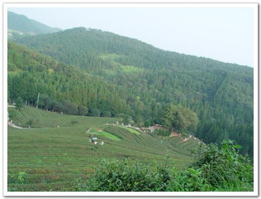

\- 보성 차밭은 풍경. 늦은 오후임에도 사람들이 많다.

\- 차밭에서 어슬렁거리는 내 동생

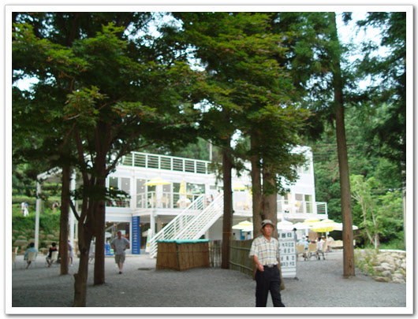

\- 차뿐만아니라, 커피까지 파는 차밭내 찻집

차 밭은 아침 해 뜨기 전 싱그러움을 느끼는 게 참 좋은데, 이번에 시간도 오후 늦은 시간이었고, 사람도 북적북적 대어 예전의 그 고요함은 별로 느낄 수는 없었다. 그래도 이렇게 전라도가 발전하는 모습을 보니 좋다. 다른 지방에 비해, 너무나 낙후되어 있어, 애처롭기 까지 한 지방인데,..

\- 내가 4학년을 다녔던 대서서초등학교. 지금은 폐교되었다.

보성군의 바로 옆 군인 고흥군이 내 고향이다. 외할아버지, 외할머니가 그 곳에 사신다. 그 곳 고흥군 대서면 으로 갔다. 보성차밭에서 한 40분 정도 걸리는 가까운 곳이다. 젊은 사람들은 다 빠져 나가 동네는 늙은이들만이 사는 활기 없는 동네로 변했다. 외할아버지 집도 예전 어렸을 때 내가 갔었던 그 모습 그대로였다. 보수 안한 시설로 인해, 모양새는 별로 없지만, 그래도 나름대로 시골의 정취가 있다.

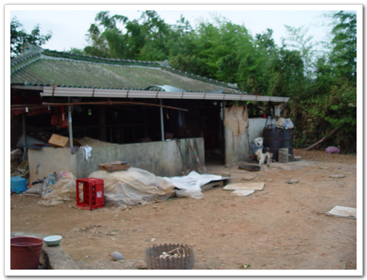

\- 외갓집 전경

\- 수돗가도 예전 그대로고,..

\- 아궁이와 솥단지도 그대로고..

\- 절구통도 그대로다.

\- TV안테나도 20년이 된건가 망가질대로 망가져있다.

\- 감나무와 내 명차 록스타

화장실 옆에는 개가 한 마리 있었다. 처음에 그냥 똥개인 줄 알았는데, 혈통 있는 애완용 개라고 하더군. 큰 외사촌이 갖다 준 것인데, 외할머니가 먹다 남은 밥으로 주고, 말 안 들으면 파리채로 때려 완전 똥개로 변모했다. 그래도 예전 애완용일 때의 성질이 남아있던지, 내게 쉽사리 경계를 풀지 않더군. 웬만한 똥개는 보통 1시간이면 내가 다 길들었는데, 이 개는 하루가 걸렸다.

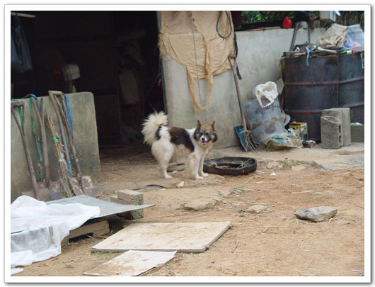

\- 화장실 및 외양간. 저 곳을 저 개가 지키고 있다.

\- 이 개. 사료대신 밥 먹고 원래 지 크기보다 두배나 더 커버린 개

\- 마당을 휘집고 다니는 송아지. 애도 참 웃기는 송아지다. 커다란게 강아지처럼 뛰어논다.

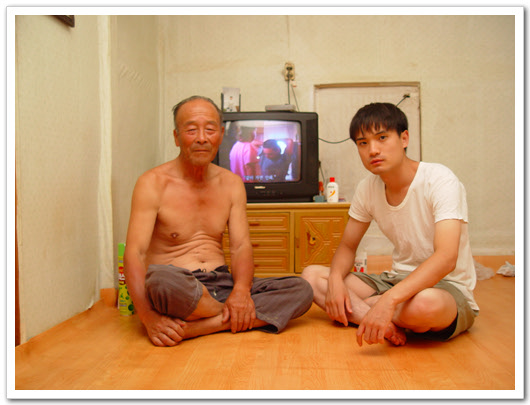

\- 외할아버지와 내 동생. 할아버지의 몸매가 꼭 날아라슈퍼보드에 나오는 사오정가 생각나게 한다

\- 설겆이 하는 외할머니

다음 날 일찍 일어나, 녹동 항으로 향했다. 녹동에는 거금도가는 배와 소록도 가는 배가 있다. 그 두 곳을 가볼려고.. 내가 어렸을 때 살았던 곳 하나가 거금도, 금산이라는 곳이다. 그곳에서 5살 때부터 7살 때까지 살았었다. 그곳 초등학교에 그곳의 다른 애들처럼 7살에 입학을 하였었고, 학습지진아로 한 달 만에 입학취소당한 눈물겨운 사연이 있는 곳이다. 한달에 한번정도 할머니 집에 가기 위해 배를 타고 육지로 왔었는데, 녹동에만 도착하면, 녹동의 장난감가게 유리창에 딱 붙어 장난감 사줄 때까지 울어댔던 것이 생각난다. 뱃시간, 차시간이 정해져있는데, 말도 안 듣고 울어대서, 성질 급한 우리 아버지가 하는 수 없는 매번 장난감을 사주곤 했었다. 그 때가 벌써 어언 25년이 지났구나.

\- 외할아버지 할머니는 일하러 나가시고..

\- 여기가 녹동 항

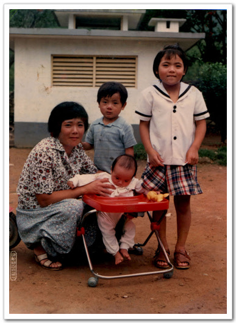

\- 금산에서 보낸 내 유년 시절. 울 엄마와, 작은 누나, 그리고 내 동생이 유모차에 있다. 나는 저 사진 찍을 때 철봉에서 떨어져 코가 빨갛게 되었던 때다.

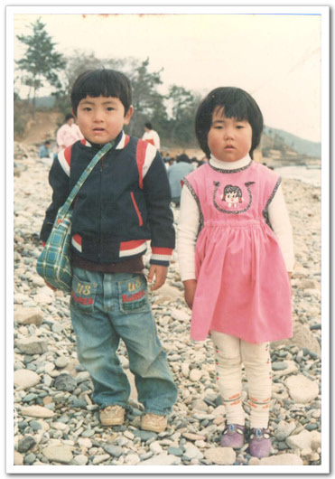

\- 소풍가서 찍은 사진. 옆이 내 첫 여자친구다. 이름은 미연.

뱃삯은 700원. 차를 가지고 가면 7천원이었다. 차를 가져가기엔 너무 비싸 디카만 들고 배를 탔다. 이곳엔 아직도 노를 저어 가는 배도 많았다. 녹동 바로 앞에 있는 소록도를 지나 30정도 가니, 금산에 도착했다. 내 예전 한 달간 다녔던, 학교를 찾아가 아버지와 함께 있던 그 기억들을 되살려보고 싶었다. 아래 사진들이 금산에 있을 때의 내 모습이다.

\- 노젓는 뱃사공

\- 금산이 이제 보인다.

난 금산에 초등학교가 하나뿐일 거라 생각하여, 버스운전사에게 초등학교 가냐고 물어봤더니, 어느 초등학교 말이냐고 되묻더군. 그래서 금산에 얼마나 많은 초등학교가 있냐고 하니깐, 한 10여개 된다고 하더군. 이름도 모르고 위치도 모르는 터라 그냥 탔다. 익숙한 지형이 나오면 내리려고...

\- 버스를 타고 어디가 내 초등학교지 하면서 주위를 살폈지..

왠지 비슷해 보이는 초등학교가 나오길래 내렸다. 학교에 들어가 봤더니, 내 기억속의 학교가 아니었다. 택시도 없었고 하여, 이번에 초등학교 찾는 것은 포기하고, 다시 배타고 나가기로 했다. 지나가는 버스 타려고 선착장 쪽으로 걸어갔다.

\- 여기가 잘못 찾은 학교

\- 선착장으로 걸어 가고 있는 나

\- 녹동행 배는 20여분 기다리니 오더군.

\- 멀어져 가는 금산. 다음번에는 차를 가지고 와서 샅샅히 뒤져야지.

배를 타고 녹동 항에 다시 돌아와, 이번엔 소록도 가는 배를 탔다. 뱃삯은 천원.

\- 국립 소록도 병원

\- 소록도 안내도

\- 소록도병원 정문

소록도는 일제시대때 나환자들을 강제 수용한 섬으로, 해방 후에는 꽤 오랜 시간 닫혀 있는 곳이었다. 그래서 내 예전 살던 곳이 바로 그 근처였음에도 불구하고 이제야 소록도에 들어가 본다. 환자들의 숙소와 자활하고 있는 곳은 제외한 섬의 반쪽만 일반인에게 개방이 되었다. 해수욕장도 개방이 되었다. 소록도의 길은 낮선 이국적인 식물들과 상업적인 시설들이 없어, 꽤 신선한 곳이었다. 하지만 그 좋은 경치 이면에는 억압당하가 무고하고 살해되고, 죽어나간 수많은 사람들의 한이 서려 있어 보이기도 하여, 두개의 상반된 느낌이 들었다.

\- 신체 검사소. 이곳에서 환자들의 인권을 아예 박탈했다고 한다.

\- 시체부검실

병원 건물까지 가는 길에는 병원관계자들과 종교 시설들, 상주 직원들의 숙소들이 있었다. 얼마나 오염되지 않은 환경이었으면, 숙소 옆 배수구에는 이런 게들도 살고 있었다.

\- 배수고에 사는 게

\- 중앙공원으로 가는 길

\- 이곳까지만 일반인이 개방된다.

중앙공원에는 많은 관상식물이 심어져 있었다. 안내문을 보니, 이 식물들은 일제시대때 대만이나 필리핀 등지에서 가져온 식물들이라고 하더군. 소록도가 조금이라도 서울에 가까이만 있었어도 사람들도 북적북적되어 한적한 맛이 없었을 텐데, 너무 멀리 떨어져 있어 개발이 안 되어 그만큼 환경이 보존되어 있는 게 다행스럽기도 하다.

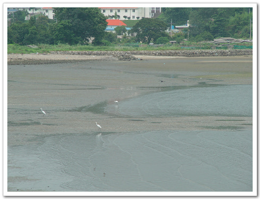

\- 개펄의 두루미(?)

나병의 공식 명칭이 한센병이라 한다.

나환자 강제 수용 시설, 운용되었던 초등학교라 한다. 지금은 빈건물과 운동장 터가 남아있다.

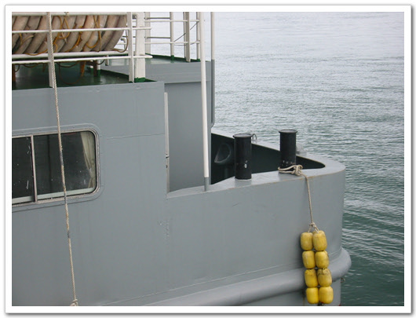

병원전용 배. 이 배는 특이하게 남자소변기가 배 뒤편에 노출되어 있다. 쉬하는 동안 운치는 있겠다..

깊은 인상을 심어놓은 소록도를 뒤로 하고, 우주센터를 짓고 있는 나로도로 향했다. 나로도는 내가 8살인가, 9살쯤에 통통배를 타고 놀러갔었던 기억이 있다. 그 때 그곳에서 난생 처음 3층짜리 양옥 건물을 봤었기에 기억에 남는 곳이다. 그 때도 다도해 해상공원으로 지정되어 놀러오는 사람들이 조금 있었는데, 지금은 연륙교로 연결되어 차로 갈 수가 있었다. 아기자기한 섬들이 떠 있고, 바다와 잘 어울리는 풍경이 보기 좋았다.

\- 나로도로 이어져있는 연륙교

\- 저런 조그만 바위섬도 있다.

\- 우주센터 기공식으로 향하는 길

나로도 근처에 있는 섬이 하나 있는데, 그게 바로 취도다. 내가 초등학교 1,2,3학년을 다닌 학교다. 내 유년시절의 추억의 대부분을 차지하는 장소다. 그때 육지에서 취도로 들어가려면 육지에서 취도 선착장으로 배를 타고 들어갔었다. 1시간에 한차례 운행을 했는데, 뱃삯은 따로 없었다. 여객회사가 하는 게 아닌, 취도 마을 사람들이 당번 식으로 배를 움직였었기 때문이었다. 명절 때와 같이 육지갈 때아니면, 그 배를 탈일은 별로 없었는데, 2학년 때였나, 육지에서 우리 오취초등학교로 학교 다니는 애와 친하게 되어, 자주 그 집에 놀러가느라, 매일 배를 타곤 했었다. 그 애 이름이 지금은 생각이 안 나지만, 2학년이면 9살밖에 안되었는데, 직접 나룻배를 저어 자기 혼자 바다를 건너다니기도 해서, 가끔 그 배타고 친구들하고 섬 뒤편으로 가서 놀기도 했었다.

\- 오취마을 가는 길

\- 여기는 신오마을

\- 저기 보이는 마을이 오취마을이다.

\- 예전엔 여기서 배를 타고 마을에 들어갔었지.

\- 취도(오취마을)에 도착했다.

지금은 방파제 비슷한 도로가 이어져, 마을 앞까지 버스가 다닌다. 차를 타고 섬 뒤쪽 길로 해서 들어갔다. 경운기만 다니는 도로다. 이 길이 아마 내 3학년 때 만들어졌던 것 같다. 그 때 포크레인도 들어오고 하면서, 길을 만들었고, 바위도 쪼개고 하였다. 바위 쪼갤 때 폭약을 전선으로 연결하여 바위를 쪼갰는데, 친구들과 그 전선을 줏으로 많이 오곤 했었다. 그 때 우리들은 그 전선을 난폿줄이라고 불렀다. 그 난폿줄을 꼬아 여러 장식구들을 만들고 했었다.

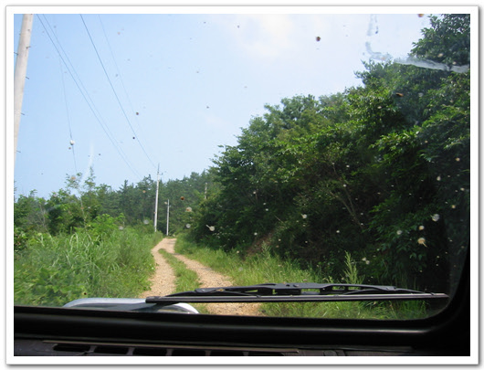

\- 오프로드용 내 차가 제 성능을 발휘하는 길

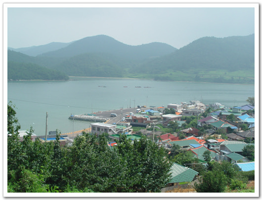

\- 오취 마을 위에서 바라다 보는 앞 바다, 남해안의 모습

오취초등학교는 폐교되었고, 이곳 취도의 애들은 통학버스로 포두초등학교로 다닌다고 한다. 학교의 모습은 별로 바뀐 것은 없었다. 교문 옆에 있던 우물이 없어지고, 철봉, 그네 등 운동기구가 없어진 것과 운동장에 소가 풀 뜯고, 내가 살았던 관사를 개와 닭들이 지키고 있는 것 외에는...

\- 우물이 있었던 자리

\- 폐교를 알리는 학교 연혁비

\- 운동장을 지키는 소

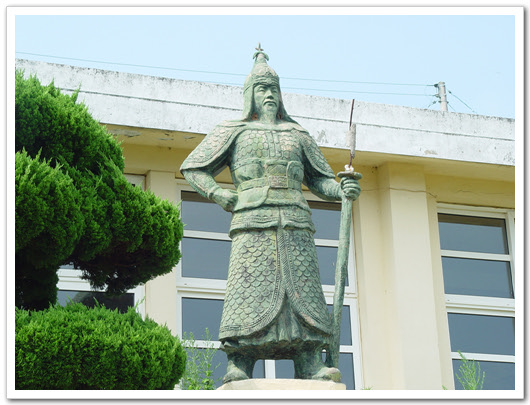

\- 여전히 위엄을 가진채 학교 밑 바라를 내려보는 이순신 장군

\- 독서의 생활화를 몸소 보여주는 책 읽는 소녀상

교실로 들어가는 문이 열려있어, 들어갔다. 예전 뛰어 놀던 그 때가 생각나더군. 칠판에는 가끔 이곳을 찾는 졸업생들이 남긴 글들이 있어 뭔가 뭉클한 기분이 들었다. 나도 뭔가 쓰고 싶었는데, 분필이 없는 관계로 못 썼다.

\- 복도. 1학년부터 6학년, 그리고 과학실, 교무실, 교장실. 이렇게 9개의 교실이 있었다.

\- 졸업생들의 흔적

\- 학교 복도에서 바다가 이렇게 가까이 잘 보인다.

\- 내 살던 관사. 맨 앞의 꺼가 교장관사, 그 옆의 교감관사, 맨 뒤에 있는 것이 우리 관사다.

\- 관사에서 마을로 내려가는 길

\- 관사를 지키는 개

\- 오취 마을 전경

선착장까지 내려가, 예전 학교 소사였던 종갑이 아저씨를 찾아갔다. 식당을 하는 집인데, 아주머니가 반갑게 맞아주었다. 장어 회에 밥을 맛있게 얻어먹었다. 예전 나로도에 다리가 놓이기 전까지는 낚시하는 사람들이 오곤 했는데, 다리 놓인 후로는 더 이상 취도에 놀러오는 사람들은 없다고 하였다.

\- 취도를 떠나며..

취도를 나와 이어 예전 할머니, 삼촌, 고모들이 모여 살던 동강으로 갔다. 지금은 그 친척들은 없다. 그 곳에서 농사만 짓고 살기엔 어려워 다들 수도권으로 올라와, 그 곳에는 찾아갈 마땅한 친척은 없었다. 먼 친척이 있긴 하지만, 안면이 없던 터라 찾아가기에는 뭐해서, 할아버지가 산소를 둘러보러 갔다.

동강, 이 곳도 사람들이 다들 빠져나가는 통에 세월에 많이 바래진 듯했다. 집 뒷산이었던 노동산에 올라갔다. 수북이 자란 풀들만이 있었다. 산 정상에는 거룩한 얼의 탑이란 게 있는데, 그 때나 지금이나 무슨 의미인지는 모르겠다. 반공의식을 고취하기 위해 만든 게 아닌 가 싶다.

\- 노동산 입구

\- 노동산 정상. 거룩한 얼의 탑이 있군.

\- 두마리의 사자가 "부모에 효도, 나라에 충성"를 외치는군.

\- 마을 입구의 사당. 어렸을 때 여기를 지날 때만 귀신나올 까봐 뛰어가곤 했었다.

\- 동네 어귀에 아름드리 나무

떠나간 빈집은 폐가 되어 쓸쓸하게 되어 있었고, 그 집 앞길은 길 자체가 없어지듯 했다. 할아버지 산소도 관리를 못한 탓에 풀들로 뒤덮여 있었다.

\- 폐가가 된 빈집. 덕분에 길도 없어졌다.

\- 풀로 뒤덮인 할아버지 산소

간 김에 동네 앞 바다까지 가 보았다. 아주 어렸을 때 간척 작업으로 바다를 막아 만들어서, 바다를 논들을 많은 지난 곳까지 밀려 있었다. 논의 개펄에서 농게 같은 것들을 잡고 그랬었는데..

\- 농로를 따라 쭉 간다.

\- 간척지의 끝

\- 앞 바다

\- 폐선도 떠있군.

\- 조용한 동네

이렇게 짧은 하루를 길게 보내고, 다시 외할아버지 집으로 돌아왔다. 할아버지 할머니는 논에 농약을 치고 계셨다. 어떠신가? 우리 외할아버지 외할머니 모습이. 멋지지 않은가?

\- 멋진 외할버지의 모습

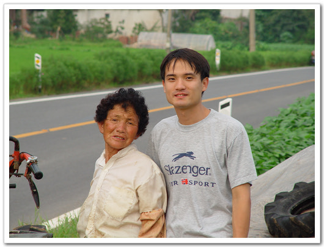

\- 외할머니와 내 동생

