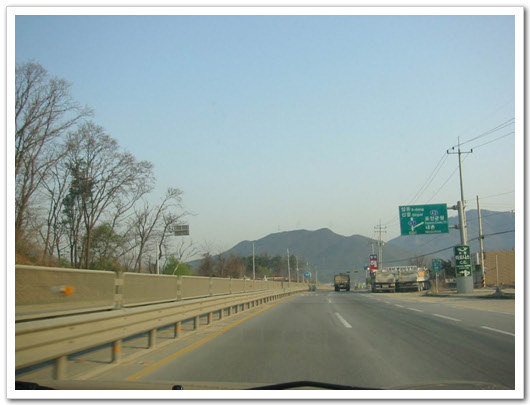

# 한식일 성묘가는 길

올해도 한식일을 맞이하여, 성묘길을 떠났습니다. 아버지가 계시는 철원으로.

아침 7시에 출발을 하니, 겨울 같았으면, 차들이 많지 않았을 시간이었겠지만, 그럭저럭 일찍 채비를 마친 차들이 많이 보였습니다.

-서울과 경기도의 경계인 노원구를 벗어나는 언덕.

-출발하자마자, 못난이 조카는 차안에서 떼를 쓰는데, 이제 식구들 모두 면역이 되어, 그냥 울어라 하지요.

-정 시끄러울때는 먹을 것 하나 물려주지요. 그러면 곧 울음을 멈추는 먹는데 열중을 한답니다.

-철원으로 오른쪽 길로 가지요.

-서울을 벗어나니, 길이 시원스럽군요.

-47번 국도를타고, 일동쪽으로 쭉 올라갑니다.

-좁은 2차선 도로를 확장하는 공사를 하고 있군요.

-여기가 6사단 오뚜기 부대 사령부가 있는 일동의 읍내이지요.

아직 8시가 안되어 그런데, 외출해 있는 군인들의 모습은 보이지 않네요.

\- 이 이른 아침에 무슨 작업을 하러 가는 군인들인지,..

트럭 위에 올라타 있는 모습이 추워보이는군요.

-경기도 포천을 지나 강원도에 들어서니, 김화가 25km 남았다는 표지판이 보이군요.

3사단 백골부대의 구역임을 나타내는 검문소가 보이네요.

젋었을 때는 이 곳을 지나칠 때마다 항시 검문을 받았었는데,

이제 나이 먹었음이 티가 나니, 요 몇 년 그냥 무사통과를 한답니다.

-예의바른 검문소 헌병.

-이제 전방임을 나타내는 군 시설물들은 곳곳에서 보이기 시작하고..

-부대들도 많이 보입니다.

-이곳이 혹시 철원평야지대? 고개를 다 넘으니, 그럭적인 넓은 땅들이 보입니다.

-승리전망대가 21km 남았다함은, 21km만 더 가면 남방한계선이란 말이군요.

-오른쪽으로 가면 고석정이 있다고 나와있군요.

고석정이 뭔고 하니, 신라 진평왕이 세운 것으로 조선 명종때 임꺽정이 고석정 건너편에 돌벽을 쌓고 칩거하여 빈민을 구제하였다는 곳인데, 현재 뱃놀이 낚시터를 알려져 있다고 하는군요..

내가 가려는 곳이 왼쪽 신철원방면. 오른쪽은 사창리라 나와있군요.

사창리는 6년전 내가 훈련받았던 보병대대가 있었던 곳인데, 지금도 그대로 인지 궁금하기는 하군요.

-왼쪽으로 꺾자마자 보이는 분대, 역시 3사단답게 백골문양이 보이는군요.

-목련공원. 내 목적지이지요.

2년전까지는 비포장 도로였는데, 이제 완전히 포장을 하여서 수월한 길이 되었지요.

-산을 쭈욱 올라가면 있는 목련공원. 공동묘지이지요.

-다들 차에서 내리고, 못난이 조카는 아직도 뾰로퉁한 표정으로 신발 신겨주길 기다리고 있군요.

-맑은 날씨임에도 시야가 그리 넓지는 않네요.

요즘 비가 오지 않아 공기중에 먼지가 많나 봅니다.

-두 조카는 카메라앞에서 포즈를 잡아보고..

-핸들돌리기를 좋아하는 조카.

-성묘를 마치고 돌아오는 길. 38선을 돌파했던 대대라고 크게 써 붙여놨군요.

-역시 백골부대가 갈 가라고 해주는군요..

