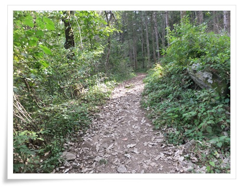

# 원주 감악산

원주에 놀러온 김에 감악산에 올랐다.

감악산은 원주보다는 파주에 있는 감악산이 더 유명한 지, 감악산으로 검색하면 파주 감악산이 먼저 뜨더군.

딸내미와 올랐다.

\- 식당이 있는 곳에서부터가 시작.

\- 다리 건너면서부터 바로 등산로가 시작된다.

\- 왼쪽이 능선코스, 직선이 계곡코스, 오른쪽은 주차장.

주차장 하루 요금이 3,000원이라고 적혀 있군.

\- 능선에서 시작하여 계곡으로 내려오던지 반대로 하던지 암튼 일주 코스다.

\- 원래 능선코스로 올라가려 했는데, 계곡 코스로 잘못 올라섰다.

\- 지팡이를 들고 딸내미 따라 오고 있다.

\- 옆으로는 계곡물이 흐르고 있다.  수량이 많을 때는 제법 걸을 만 하겠다.

\- 오솔길 수준의 등산로

\- 딸내미는 벌써 부터 다리 아프다는 투정 중

\- 계곡을 통과하는 길이 돌로 다져져 있는 것을 보니 예전에는 제법 사람이 많은 등산로였던 것 같다.

\- 상류쪽으로는 계곡에 물이 없다.

\- 중간 정도 올라왔다.

계곡코스 정상이 1.3km 정도 남았다.

\- 길은 좀 더 가늘어진다.

\- 이제 2/3 지점

\- 능선코스는 국유림이 아니어 관리가 안되고 있으니 조심하라는 경고문.

\- 능선코스로 가기 위해서 감악산 정산으로 향한다.

\- 딸내미는 이제 투정도 없이 잘 올라오고 있다.

\- 여기가 감악산의 계곡정상

1Km앞이 감악산 정상.

\- 능선쪽 길은 바위가 많다.

\- 올라왔던 계곡 코스와 출발했던 황둔리 마을이 보인다.

\- 바위 위에서 딸내미와 잠시 휴식중.

\- 나무들 사이로 백련사가 보인다.

시간이 여유 있으면 들러보겠는데, 오후 4시라 하산해야 했다.

\- 여긴 좀 양호한 능선 길

\- 능선코스 시작점.

\- 이제 본격적인 난코스.

\- 산 줄기가 멋있다.

\- 감악산 능선 봉우리

\- 감악산 원주쪽 정상

\- 정상에서 바라본 원주 황둔리.

\- 하산길은 가파른 바위 길이다.

딸내미 미끄러질까 염려되어 허리에 줄을 묶었다.

\- 절벽에 가까운 바위를 줄과 발 받침 딛고 지난다.

\- 여기도 90도에 가까운 코스.

\- 유격 보내도 될 정도로 잘 내려오고 있다.

\- 내려오니 이제 해는 졌다.

\- 하산길에 있는 식당에서 키우는 듯 한 개냥이가 살갑게 군다.

\- 총 6Km.  3시간 반 소요.

짧으면서도 여러가지 등산의 재미가 있는 코스다.

[이글루스 가든 \- 여행다니기](http://garden.egloos.com/10001194)

