# 경기도기술학교에서 자동차오너정비교육

[경기도 공식 블로그](http://ggholic.tistory.com/) 를 통해 경기도기술학교( [http://vo.gg.go.kr](http://vo.gg.go.kr))에서 경기도민 대상으로 자동차정비교육을 한다는 것을 알았다.

냉큼 신청했다.

2주동안 토요일에 진행을 하는 교육 프로그램이었다.

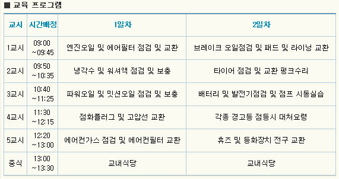

\- 1,2일차 교육 프로그램.

내용 자체는 내가 한번 씩 해 본 것이긴 한데, 그래도 이런 배움의 기회가 없었기에 재미있을 듯 하여 신청했다.

내비에 경기도기술학교를 찍으니, 집에서 35분 걸린다고 나왔다.

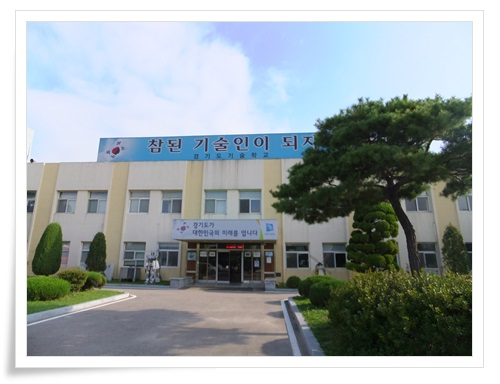

\- 경기도기술학교 본관

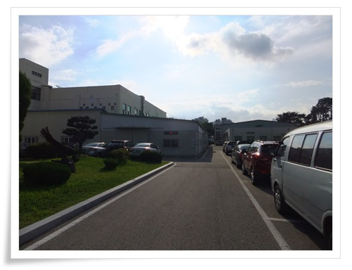

-주차를 하고 실습장을 찾아 나섰다.

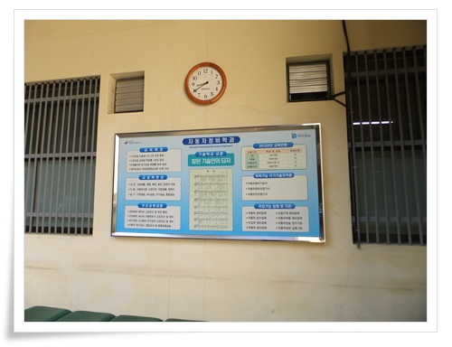

\- 여기가 자동차정비학과

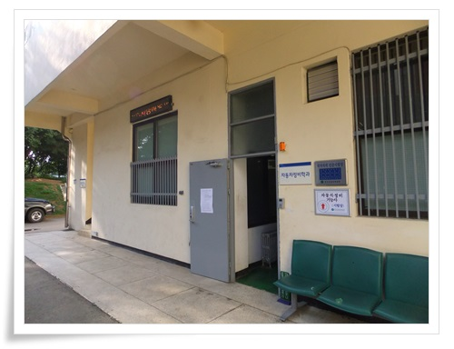

\- 여기가 이번 교육과 실습하는 장소.

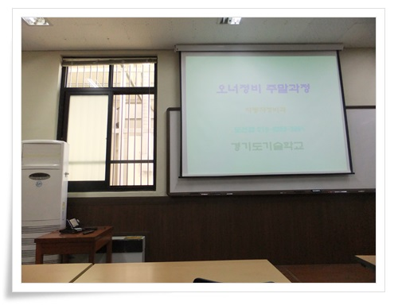

\- 강의장에 들어갔다.

이번에 같은 교육받는 사람은 정원 20명.

2시간 이론교육과 2시간 실습했다.

\- 받은 교육 책자.

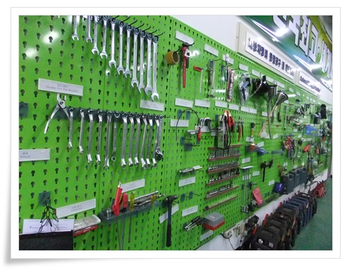

\- 나의 눈을 사로잡는 공구들.

나도 돈 많이 있으면, 벽면을 이렇게 만들고 싶다.

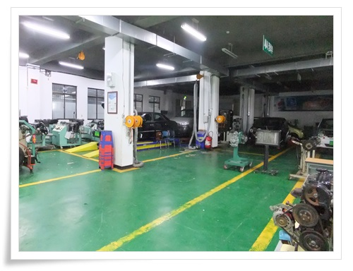

\- 실습장 내부.  현대기아차 엔진과 차들이 있다.

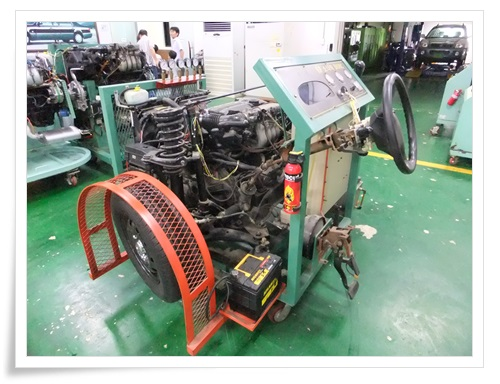

\- 엔진에 구동바퀴와 핸들만을 붙여 실습하는 장비.

요런 것 하나 있으면 참 재미있겠다.

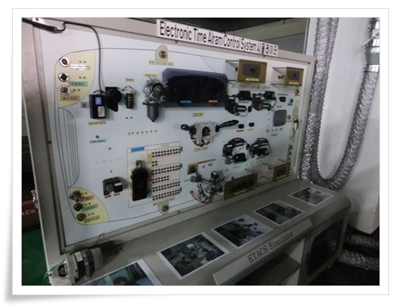

\- 배선도도 이렇게 직접 볼 수 있다.

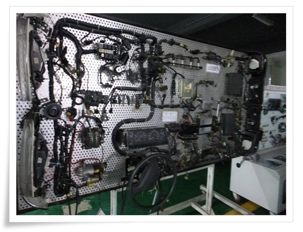

\- 한눈에 들어오는 배선.  참 아름답다.

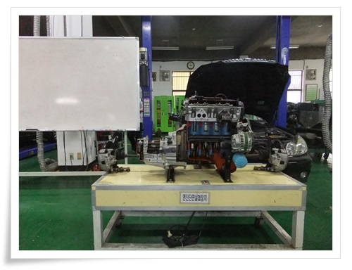

\- 실습시간, 이렇게 실습장에서 엔진 단면을 앞에 놓고 설명을 들었다.

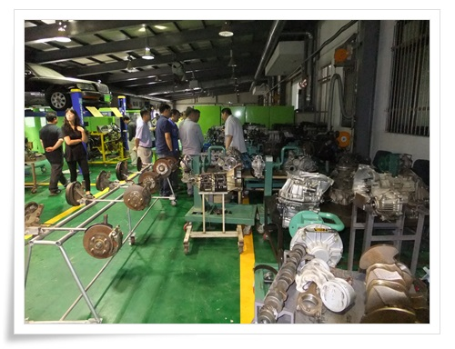

\- 여기저기 구경하고, 물어보는 수강생들.

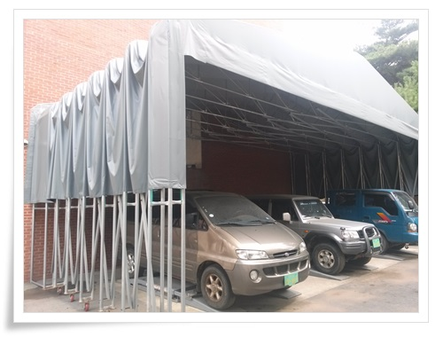

\- 외부에도 이렇게 실습용 차들이 있다.

이 차들을 싸고 있는 저 이동식 호로가 참 맘에 든다.

나도 저렇게 이동식 호로로 작업장을 만들어 보고 싶군.

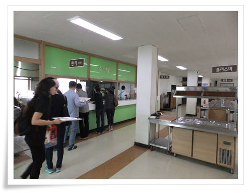

\- 교육끝나고 식사시간.  식사가 무료제공되었다.

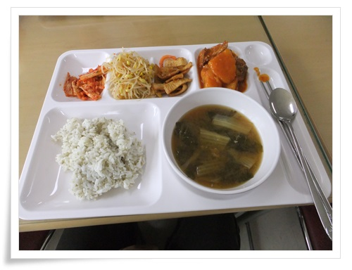

\- 밥이 아주 맛있더군.

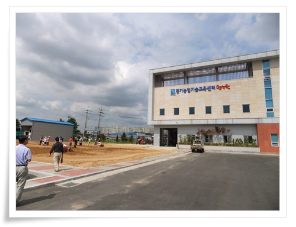

\- 기술학교옆에 농업기술교육센터가 있어 구경을 했다.

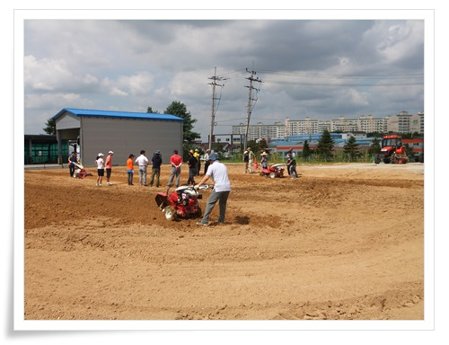

\- 농기계로 땅뒤집는 실습시간인가 보다.

재밌어 보인다.

경기도민으로서 이런 교육 시설을 이용할 수 있어  뿌듯하다.

이런 교육을 기획한 분께 얼굴도 모르지만 암튼 감사하다.

