# 카니발2 후방감지기와 블랙박스 DIY

동생의 카니발2에 후방감지기와 블랙박스를 달기로 했다.

모두 이전에 폐차한 내 카니발에서 적출한 것으로 했다.

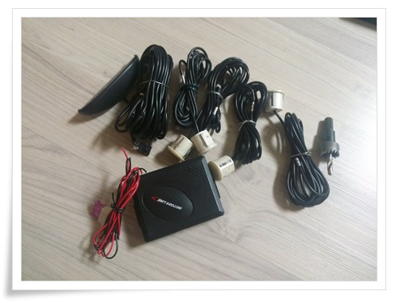

\- 이번에 달 후방경보기.

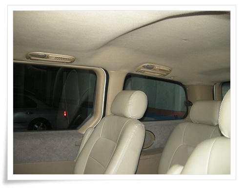

\- 후미등에서 C필러, B필러, A필러까지 천정속으로 배선을 집어넣었다.

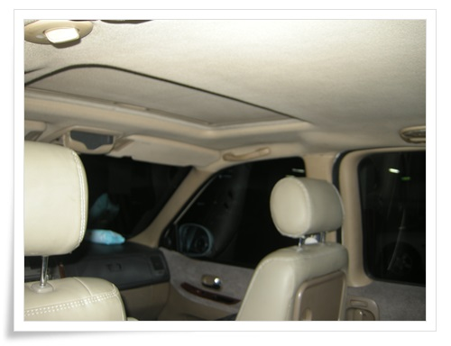

\- 그 다음, A필러에서 룸미러쪽으로 역시 배선을 집어넣고,

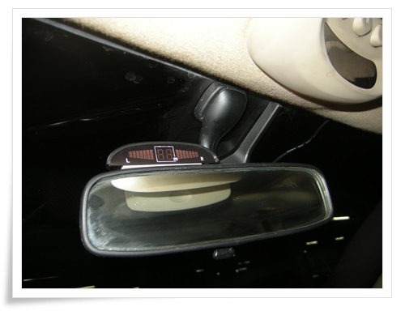

\- 룸미러 위에 디스플레이를 부착했다.

[예전에 한번 작업한 경험](../10242518.html) 이 있었기에 이번엔 좀 쉽게 할 줄 알았다.

개뿔..

여전히 어려웠다.

그나마 빨리 한 것은 배선을 앞으로 뺀 것만..

그 다음 블랙박스.

블랙박스는 전원을 따 오기로 했다.

시거잭에서 선을 길게 연결하면 아무래도 보기 지저분하여 퓨즈박스에서 따 눈에 안 띄게 하기로 했다.

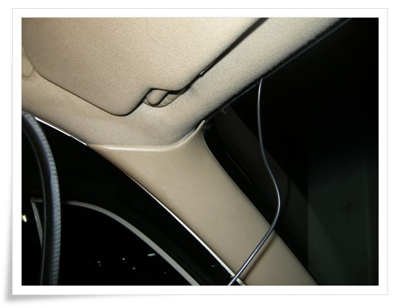

\- 선을 숨기기 위해 먼저 A필러의 고무를 벗기고,

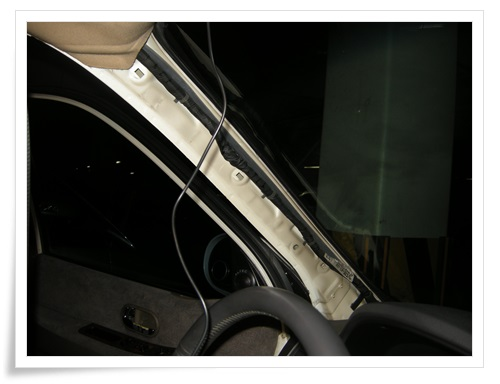

\- 그 다음 A필러를 힘으로 뜯었다.

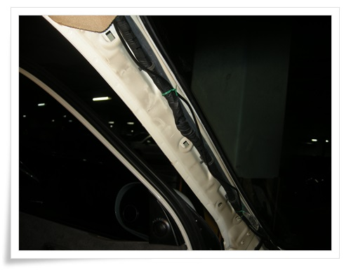

\- A필러 안에 선을 고정하고,

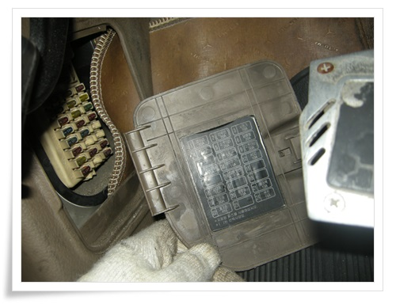

\- 운전석 밑의 퓨즈박스를 열었다.

시거잭의 위치를 확인한다.

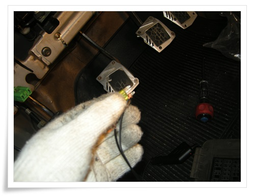

\- 퓨즈 한쪽 끝에 선을 연결

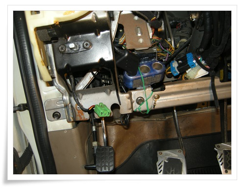

\- 멀티소켓을 앞 판넬안쪽으로 글루건과 선으로 고정했다.

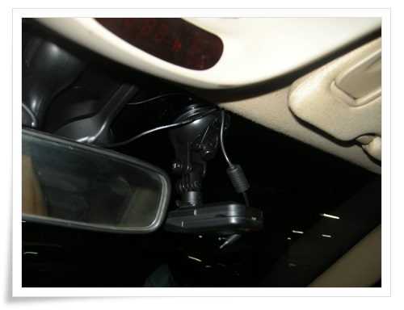

\- 블랙박스 설치 완료

총 작업 시간 3시간

이 날의 실수는 배선작업할 때 전원 극성을 거꾸로 연결하여 멀티소켓하나 망가뜨린 점.

그리고 후방감지기 센서는 위아래 방향이 있는 것을 까먹고 설치했다가 다시 빼서 재 설치한 점.

