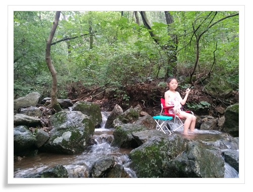

# 골안사계곡으로 피서

올 여름 제법 덥다.

제법 덥긴 한데, 오히려 정부에서 블랙아웃이다 뭐다, 과장하는 듯 해 보이긴 하다.

더위를 피해 가끔 가는 곳이 바로 집 근처 골안사 계곡.

집에서 3km 정도 있는 곳으로, 가깝기도 하고, 무엇보다도 사람이 많이 않다는 점이 가장 큰 장점이다.

\- 불곡산 자락의 골안사가 있는 계곡.

\- 계곡 피서의 진면목을 보여주고 있는 딸내미

규모도 작고, 수량도 그리 많지 않지만, 요즘 같이 스콜이 자주 내리는 때면 물도 많아 제법 계곡다운 모습을 보여주고 있다.

간만히 먹을 과일과, 의자를 들고 계곡으로 피서.

-이번에 같이 간 오지은씨 식구

-딸내미와 동근이의 물에 발 담그고 하는 권총 게임.

\- 가만이 있으면 심심하니, 애들 데리고 정글 탐험 시작.

\- 평균 수심 애들 정강이 근처라 탐험으로 적당한 코스.

