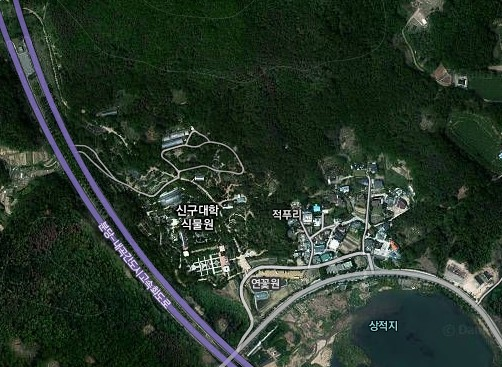
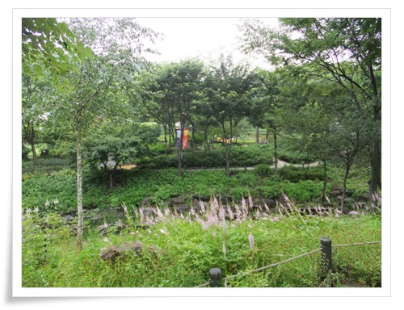
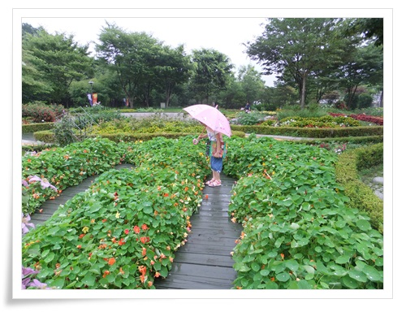
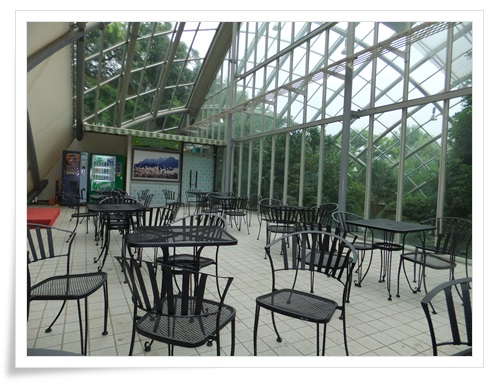
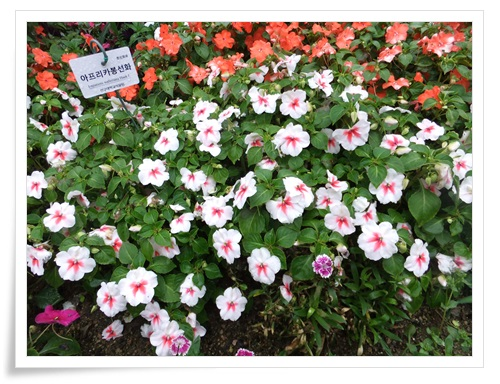
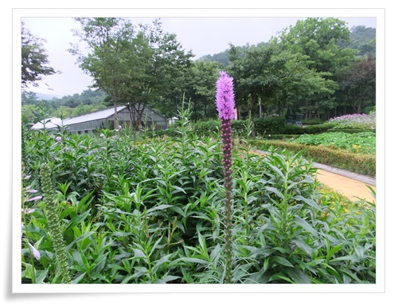
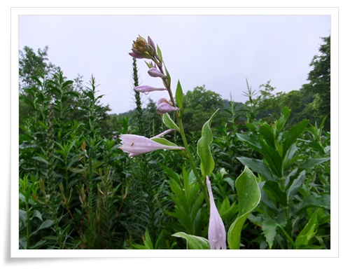
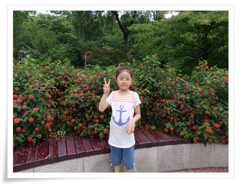
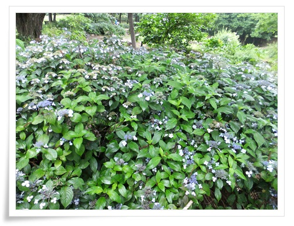
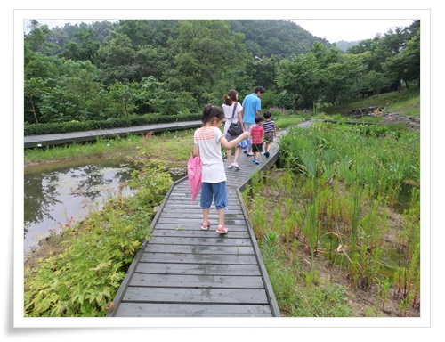

# 신구대학 식물원 구경

지난 봄 청계산 갔다가 집에 오는 길에 발견한 신구대식물원.

명색이 동네탐험가인 내가 이런게 있는 지를 그때서야 알게 되었다.

집에 들어가서 검색해보니 관람객이 별로 없어, 한적하니 천천히 산책하기 좋은 곳이라는 평이 많았다.

\- 신구대학 식물원의 위치.  청계산에서 성남 고등동쪽으로 오는 길에 있다.

비오는 일요일 오후 식물원으로 향했다.

아무래도 식물원은 뜨거운 날씨보다는 비가 촉촉히 내리는 날이 구경하기 좋겠다라는 생각에 비오는 날을 기다렸다.

입장료는 어른 5,000원, 어린이 3,000원.

\- 아기자기하게 잘 꾸며진 내부

\- 연꽃 종류였는데 이름을 까먹었다.  빗망을 뭉쳐있는 모습이 좋더군.

\- 물방울에 신기해하는 딸내미.

\- 에코관이라는 유리관 내부 휴게실.

비오는 하늘을 바라보는 게 꼭 차 안에서 썬루프를 바라보는 느낌이다.

\- 아프리카 봉선화.

\- 딸내미가 찍은 꽃 사진들.

\- 셀카질 하는 모습을 보고 지나가는 아저씨가 찍어줬다는 딸내미 사진.

\- 보라색이 섞여 있는 꽃인데, 비오는 날에 잘 어울리는 꽃.

\- 작은 습지도 있다.

식물원을 많이 가 보지는 못했다.

그래도 내가 가 본 식물원 비슷한,  아침고요수목원, 물향기수목원, 한택식물원, 평창허브나라 중 여기 신구대학식물원이 제일 마음에 든다.

비오고 심심할 때 다시 한 번 와 봐야 겠다.

