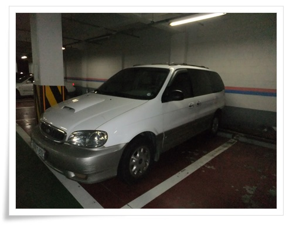

# 카니발 폐차

2009년 8월 30일 거금 240만원을 주고 구입한 2000년식 카니발 Park 1 디젤을 폐차했다.

4년간 잘 달려줬고, 매우 만족스런 차였지만, 정기검사를 앞두고 정상적인 배기가스 통과가 어렵고, 타이밍벨트도 교체할 시기도 오고 하여 잔존가치가 폐차보상금보다 낮아졌다고 판단했다.

\- 폐차장으로 끌려가기 직전 모습

총 주행거리 263,313km.

꽤나 만족스런 차였고, 이 차로 여러 곳 여행도 한 추억이 있어, 떠나보내는 마음은 좀 슬프기도 했다.

그동안 차에 들어간 비용을 계산해봤다.

세금과 보험금을 제외하고, 4년간 유지보수에 들어간 총 비용 :  175만원

광택 및 실내클리닝 : 300,000

엔진오일 교환 5회  : 170,000

알터네이터(재생) 교환 : 180,000

스페어타이어 거치볼트 교환 : 15,000

타이어 4개 교체 : 400,000

후미등 교체(DIY): 20,000

냉각수 교체 : 33,000

하이드로백, 브레이크 오일 교체 : 300,000

중고 범퍼 교체 : 150,000

썬팅 : 70,000

냉매보충 2회: 90,000

연료필터 교체(DIY) : 10,000

글라스런 교체(DIY) : 15,000

폐차는 인터넷에서 검색하여 대행을 맞겼다.

폐차닥터라고 하는 데에 맞겨 총 55만원을 받았다.

일처리가 썩 깔끔하지는 않았다.

처음에 문의하니 65만원 고철값이 나온다고 했다.

신청하니, 대리운전기사가 왔다.  인수증 같은 것 없이 운전해가는 게 좀 불안하긴 했지만, 다행히 별 문제는 없었다.

양주에 있는 폐차장까지 간다고 하더군.

그리고 폐차장에서 걸려온 전화가 저감장치장착된 차량이라서 10만원 자기부담금을 내야한다고 해서 65만원-10만원=55만원을 받았다.

폐차서류를 보험사에 직접 팩스 넣어준다고 했는데, 실제로 그게 잘 안되어 보험사와 폐차대행인게 너댓번 전화를 해서 보험도 해지했다.

나의 첫 21세기차는 보내고, 다시 20세기차로 내려왔다.

100만원 주고 구입한, 99년식 EF소나타.

