# 성남시 어린이날 행사 구경

성남시 소식지로 비전성남이란게 있다는 것을 현수막을 통해 알게 되었다.

전자책으로도 나오더군.

전자책으로 다운로드 받아 보니, 그 중 5월 5일 어린이 날 행사 소식이 있었다.

성남시청과 인근 공원등에서 하는 소식이 있었다.

어린이날에 어디 놀이공원 갔다가는 사람 구경밖에 못 하기에 나갈 생각을 않고 있다가 나갔다.

판교생태학습원에서 '지구를 지켜라'라는 주제로 어린이날 행사를 한다고 하여 그리로 향했다.

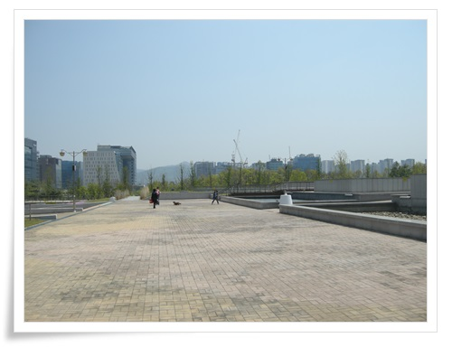

\- 생태학습원 옆 수질공원인가 하는 곳의 주차장에 주차하고 행사장으로 가고 있다.

판교는 아직 공사중이군.

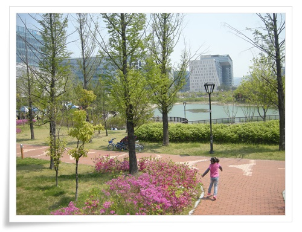

\- 여기가 생태학습원 화랑공원.

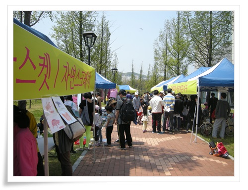

\- 한 10개 부스로 해서 행사가 진행중이었다.

대부분 자원봉사자로 구성이 되었으며, 부담감이 없이 편한 분위기였다.

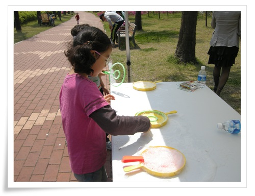

\- 재활용 물방울 놀이.

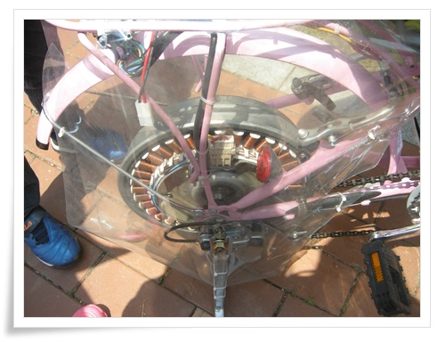

\- 그리고 자전거 발전거.

내가 가장 관심있는 거였다.

나도 자전거 발전기를 만들고 싶어 예전에 자료를 검색을 좀 해 봤다.

가장 좋은 재료가 통돌이 세탁기에 떼낸 모터로서, 그게 가장 가격대 성능비가 좋다고 하더군.

이것도 생김새를 보아하니 세탁기 모터인 듯 하다.

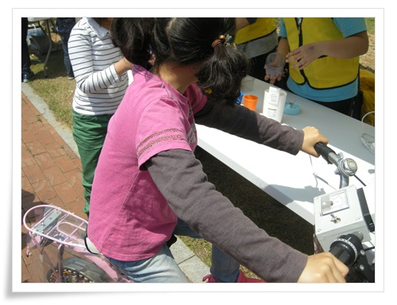

\- 자전거의 구조는 발전기->인버터로 220볼트 변환 -> 믹서기 이렇게 되었다.

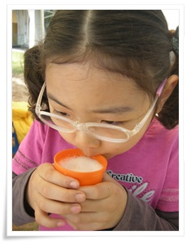

\- 체험 방법은 자전거 발전거로 믹서기를 돌려 과일주스 먹는 것.

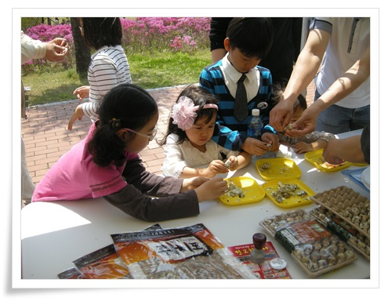

\- 그리고 태양열 조리기로 음식 만들어 먹는 것도 있었다.

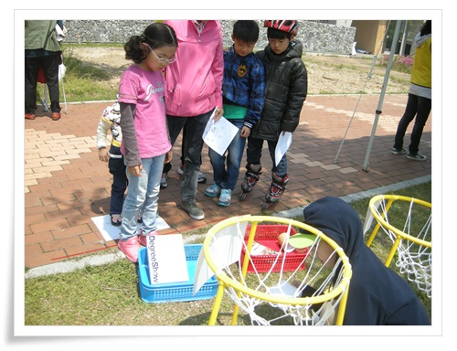

\- 그리고 재활용분리 놀이.  진행요원은 초등학교 3학년정도로 보이는 남자애 한명이서 하더군.

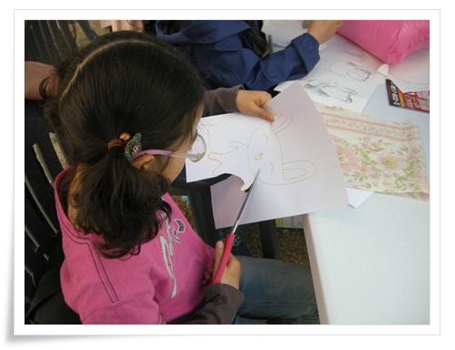

\- 재활용 인형 만들기.

먼저 만들기 싶은 것을 그림 그리고, 그걸 천에다 옮겨 그린 다음, 바느질하고 만들기.

꽤나 시간이 많이 걸리더군.

결과물로 생각과 달리 엉망으로 나왔다.

생태학습원 체험을 마치니 시간이 오후 두시.

아직 해도 중천이고 하여 시청으로 갔다.

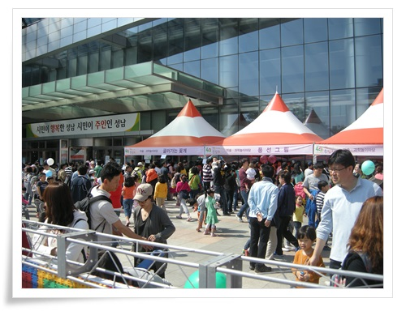

\- 시청 행사장은 사람이 아주 많았다.

시장이 바뀌고 나서 시청도 개방되고, 시민을 위한 공간과 행사도 늘어나 만족스럽다.

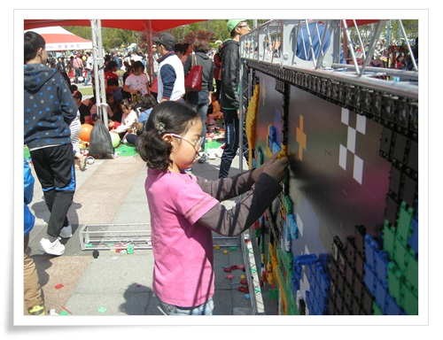

\- 이번 시청 행사에게 가장 여유롭게 할 수 있었던 블럭 놀이.

