# 분당에 있는 잡월드 어린이 체험관 구경

몇년전부터 판교IC와 분당수서간도시고속도로 사이 공터에 뭔가를 시작하더니, 작년엔가 한국잡월드라고 하는 건물이 들어섰다.

명색이 동네탐험가인데 새로 생긴 것 탐험이 늦었다.

일요일 점심때쯤  딸내미를 데리고 잡월드로 갔다.

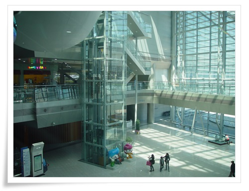

\- 잡월드 내부

어린이체험관 체험료가 어린이 18,000원.  보호자는 9,000원이었다.

발권을 하면 사원증처럼 생긴 태그를 목에 걸고 다니는 거다.

그리고 조이라고 하며 돈처럼 생긴 것 50조이를 같이 주더군.

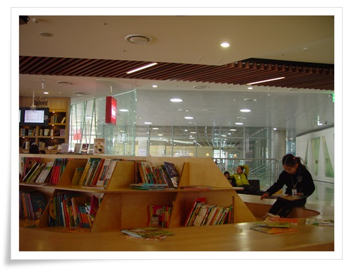

\- 1층에 한적한 곳에 어린이 책 볼 수 있는 공간도 있더군.

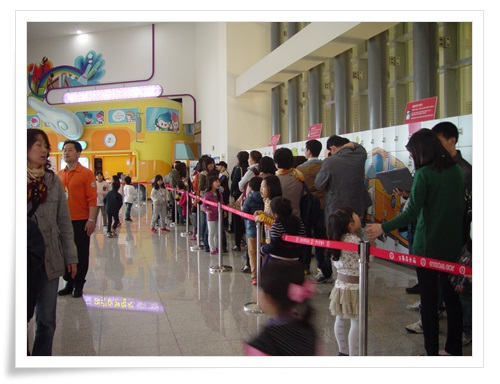

\- 오후 시작 시간이 2시반인데, 벌써 줄이 길었다.  현 시각 2시정각.

입장시간까지 30분을 기다렸다.

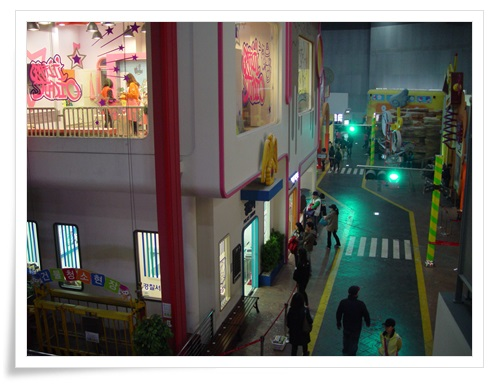

\- 어린이체험관 내부.  여러 체험시설을 건물로서 배치해 놓았다.

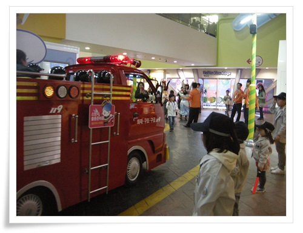

\- 가장 인기있던 체험코스 소방수와 경찰관.

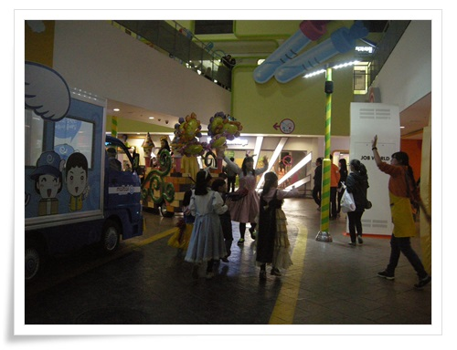

\- 놀이공원 무용수 체험도 이렇게 길거리 공연을 체험하더군.

딸내미보고 저것 할래?하고 물어보니 이제 자기도 컸다고, 저런 유치한 것은 안한다고 하는군..

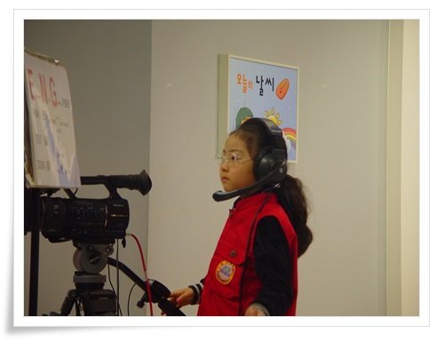

\- 방송국 엔지니어 체험부터 시작했다.

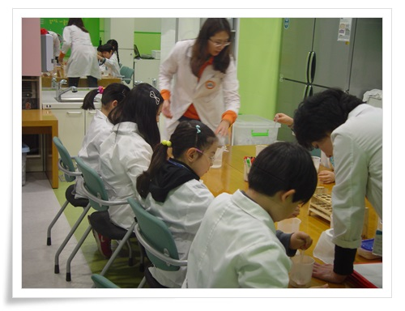

\- 생명과학연구원이 되어 치약만들기도 해보고..

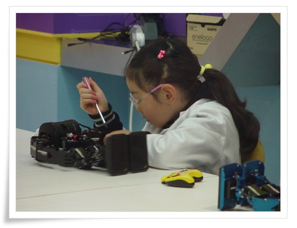

\- 로봇개발자가 되어 로봇을 만지작해보기도 하고..

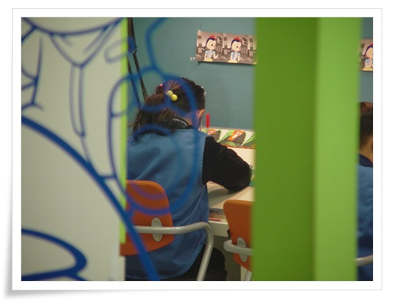

\- 애니메이터가 되어 그림 그리고,

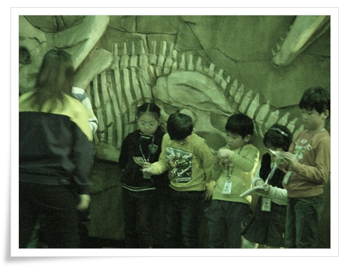

\- 고생물학자가 되어 공룡 발굴,

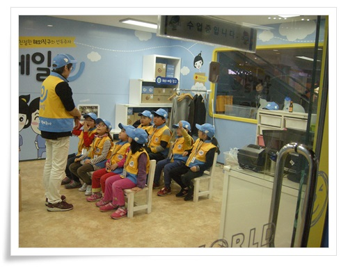

\- 택배기사가 되어 택배 배달을,..

2:30부터 6:10분까지, 총 6개 코스를 했다.

각 체험코스별로 돈을 벌기도 하고, 쓰기도 하는데 내부에서 사용하는 화폐단위로 조이를 썼다.

대부분 돈을 버는데, 뭔가 만들어서 가져가는 것은 돈을 내는 방식이었다.

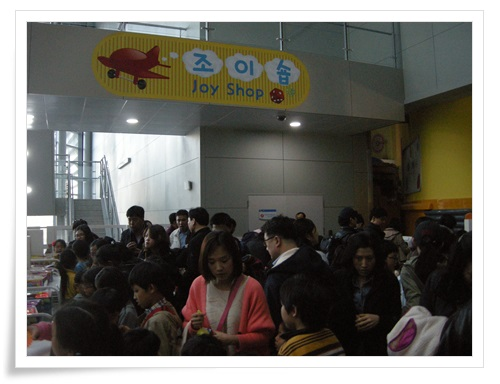

\- 체험장 밖에는 조이샵이라고 있어, 체험을 통해 번 돈으로 기념품을 살 수 있었다.

딸내미가 산 것은 70조이짜리 그림패드.

애들이 아주 좋아할 만 했다.

땔내미도 아주 좋아했다.

헌데 애랑 같이 온 부모들을 꽤나 힘들겠더군.

마치 백화점 따라온 남편/남자친구를 체험할 수 있는 곳이다.

애를 체험장에 입장시키고, 그 체험시간동안 밖에는 마냥 기다려야 하는 거였다.

이번 잡월드에서 쓴 돈은 총 37,500원

주차료 : 4,000원

어린이체험장 : 27,000원(어린이 18,000 + 어른 9,000)

점심(햄버거1개) : 6,500원

